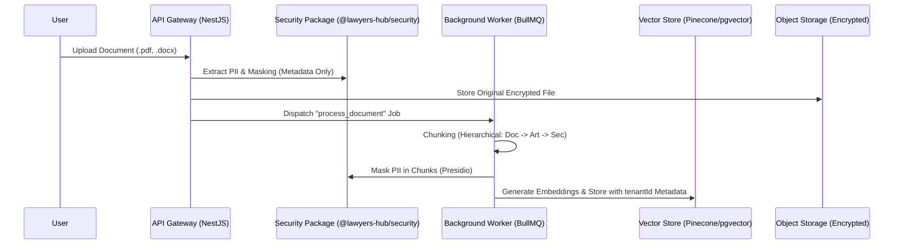
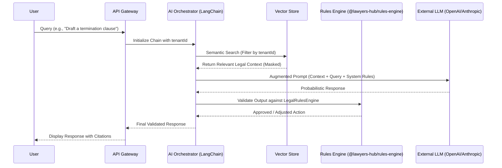

# 🧠 AI & RAG Pipeline Flow

This document outlines the end-to-step process of how Lawyers Hub processes legal documents and generates AI-assisted content while maintaining strict data privacy and legal accuracy.

## 1. Document Ingestion Flow (Background)

### Key Technical Details:
- **Hierarchical Chunking**: Unlike standard chunking, legal documents are split based on their structural hierarchy (e.g., Articles, Paragraphs) to ensure that the AI understands the context of a specific legal clause.
- **Tenant Isolation**: Every vector stored in the database is tagged with a `tenantId`. RLS-like filtering is applied at the query level.

## 2. Retrieval & Generation Flow (User Request)

### Strategic Oversight:
- **Masked Retrieval**: We retrieve masked data from the vector store. The LLM never sees the raw PII of the client.
- **Deterministic Validation**: The `LegalRulesEngine` checks if the AI-generated clause violates any rigid firm policies or local laws.

## 3. Best Practices for RAG
- **Hybrid Search**: We combine semantic search with keyword matching (BM25) to ensure that specific legal citations are found even if they are semantically distant.
- **Explainability**: Every response must include citations back to the source document chunks to allow human verification.
- **Cost Optimization**: Chunks are cached in Redis to avoid redundant embedding generation and vector search for common legal queries.
