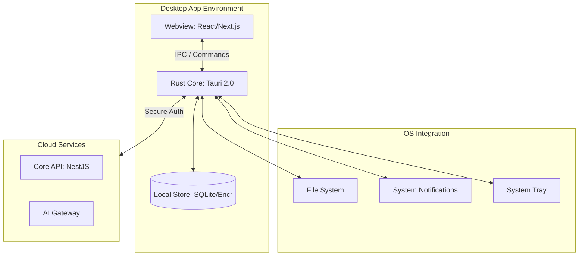

# Lawyers Hub — Desktop (Tauri 2.0) System Overview

**Status:** DRAFT **Versi:** 1.0.0 **Tanggal:** 2026-01-07 **Pemilik:** System Architect

## 1. Pendahuluan
Aplikasi Desktop Lawyers Hub dibangun menggunakan **Tauri 2.0** sebagai lapisan presentasi native yang melengkapi pengalaman web. Fokus utama aplikasi desktop adalah untuk memberikan performa tinggi, akses sistem file lokal yang aman, dan kemampuan bekerja secara offline/hybrid bagi para profesional hukum.

## 2. Arsitektur Komponen
Aplikasi desktop memisahkan tanggung jawab antara antarmuka pengguna (Frontend) dan logika sistem native (Backend/Rust).

### 2.1 Struktur Logical

## 3. Fitur Utama & Keunggulan
1. **Local File Integration**: Integrasi langsung dengan folder dokumen hukum di komputer pengguna dengan izin yang dikontrol ketat.
2. **Offline-First Drafting**: Memungkinkan pengacara untuk menulis draf dokumen tanpa koneksi internet, dengan sinkronisasi otomatis saat kembali online.
3. **Enhanced Security**: Enkripsi data di tingkat lokal menggunakan standar industri untuk melindungi data klien yang sensitif.
4. **Native Performance**: Pengolahan dokumen besar dan enkripsi dilakukan di sisi Rust untuk performa maksimal.

## 4. Keamanan & Kepatuhan (Compliance)
- **Encryption at Rest**: Semua data lokal yang disimpan di `LocalDB` wajib dienkripsi.
- **IPC Security**: Penggunaan `commands` dan `events` di Tauri dibatasi hanya untuk fungsi yang diperlukan (principle of least privilege).
- **Auditability**: Semua akses ke file lokal dicatat dalam audit log lokal yang akan disinkronkan ke server pusat.

## 5. Rencana Integrasi
Aplikasi desktop akan berbagi logika bisnis yang sama dengan aplikasi web melalui `packages/` di monorepo, namun dengan tambahan kapabilitas native yang hanya tersedia di desktop.

---
*Dokumen ini merupakan bagian dari ekosistem dokumentasi Lawyers Hub.*
