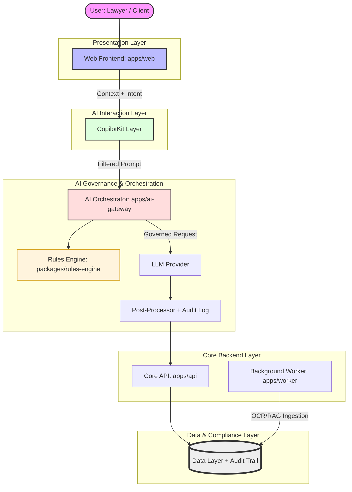

# Lawyers Hub — System Architecture Overview

**Status:** ACTIVE (Aligned with Foundation v1.0) **Versi:** 1.0.0 **Tanggal:**
2026-01-05 **Pemilik:** Product Owner / System Architect

Dokumen ini mendefinisikan **arsitektur sistem menyeluruh Lawyers Hub**,
diturunkan langsung dan **WAJIB konsisten** dengan `00_foundation/README.md`.

---

## 1. Tujuan Dokumen

- Menjelaskan arsitektur teknis Lawyers Hub secara end-to-end
- Menjadi referensi utama untuk seluruh engineer dan AI agent
- Mengunci batasan sistem, integrasi, dan tanggung jawab komponen
- Menjadi dasar desain detail (API, data flow, security, AI governance)

---

## 2. Ruang Lingkup

Dokumen ini mencakup:

- Arsitektur logical & physical
- Interaksi AG-UI, CopilotKit, dan backend
- Boundary data, AI, dan keamanan

Dokumen ini **tidak** mencakup:

- Implementasi kode detail
- Konfigurasi infra spesifik vendor

---

## 3. Prinsip Arsitektur Utama

1. **Assistive AI Architecture** AI selalu berada di lapisan bantuan, bukan
   eksekusi.

2. **Multi-Tenant by Design** Isolasi data & konteks adalah default.

3. **API-First & Event-Aware** Semua kapabilitas diakses via API & event.

4. **Governed AI** Tidak ada AI tanpa policy, audit, dan trace.

5. **Legal-Grade Security** Confidentiality > convenience.

---

## 4. High-Level Architecture Diagram (Logical)

---

## 5. Dokumen Terkait

- [Foundation README](../00_foundation/README.md)
- [Core Features Specification](../03_product_features/core_features_spec.md)
- [Prompt Governance](../02_ai_and_rules/prompt_governance.md)
- [User Journey & Interaction Flows](../03_product_features/user_journey_and_flows.md)
- [Analisis & Rencana Implementasi CopilotKit](<../00_foundation/Analisis%20&%20Rencana%20Implementasi%20%E2%80%94%20Lowyers-Hub%20%C3%97%20CopilotKit%20(agentic%20+%20UI%20+%20actions%20+%20shared%20state).md>)
