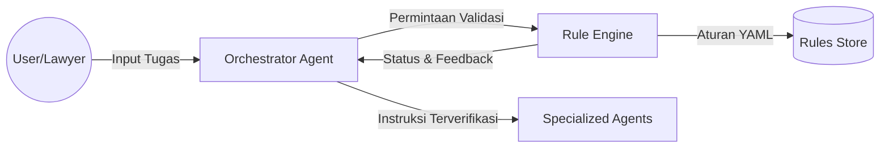

# 📘 Design Document: Rules Documentation Framework (v4.1)

**Project:** Lawyers Hub **Status:** Implementation Ready **Last Updated:**
2026-01-02 **Owner:** Core Architecture Team, Legal, Compliance, & Product

---

## 📑 Metadata & Version Control

| Field                      | Value                  |
| :------------------------- | :--------------------- |
| **Document ID**            | LH-DOC-RULES-FRAMEWORK |
| **Confidentiality**        | Internal Use Only      |
| **Review Cycle**           | Quarterly              |
| **Next Review**            | 2026-04-02             |
| **Accessibility Standard** | WCAG 2.1 Compliant     |

### **Version History**

| Version | Date       | Author      | Reviewer     | Description                |
| :------ | :--------- | :---------- | :----------- | :------------------------- |
| 1.0.0   | 2025-12-15 | Arch Team   | Legal Lead   | Initial Framework Design   |
| 2.0.0   | 2026-01-02 | Super Agent | Compliance   | Enhanced guidelines        |
| 3.0.0   | 2026-01-02 | Super Agent | Stakeholders | OMAS & templates           |
| 4.0.0   | 2026-01-02 | Super Agent | Architecture | SDLC integration           |
| 4.1.0   | 2026-01-02 | Super Agent | Stakeholders | Architecture diagrams      |
| 4.2.0   | 2026-01-02 | Super Agent | Lead Arch    | Analysis methodology       |
| 4.3.0   | 2026-01-03 | Super Agent | Architecture | Integrated Agent Supervisor |

---

## 1. Pendahuluan

### 1.1 Latar Belakang

Dalam era transformasi digital, pengembangan perangkat lunak hukum menghadapi
tantangan unik yang sering disebut sebagai "krisis perangkat lunak" dalam domain
legal-tech: ketidaksesuaian antara logika kode yang kaku dan interpretasi hukum
yang dinamis. Lawyers Hub (PLH) mengatasi ini dengan **Agentic Rules**, sebuah
sistem saraf pusat yang mengontrol perilaku otonom AI Agents menggunakan
kerangka kerja _Orchestrated Multi-Agent System_ (OMAS).

### 1.2 Visi & Misi

- **Visi**: Menjadi standar global dalam dokumentasi aturan hukum yang dapat
  dieksekusi mesin (_computable law_).
- **Misi**: Mengintegrasikan analisis terstruktur dan desain sistem ke dalam
  praktik hukum untuk meminimalkan risiko "halusinasi" AI.

---

## 2. Tujuan & Ruang Lingkup

### 2.1 Tujuan

1. **Akurasi Hukum Terjamin**: Menggunakan referensi hierarkis (UU > PP > Perda)
   untuk setiap keputusan AI.
2. **Transparansi Operasional**: Setiap tindakan AI harus dapat dijelaskan
   (_explainable AI_) dan diaudit.
3. **Skalabilitas Sistem**: Memungkinkan penambahan domain hukum baru tanpa
   merombak arsitektur inti.
4. **Keamanan Data & Privasi**: Kepatuhan penuh terhadap UU PDP No. 27/2022
   melalui anonimisasi otomatis.

### 2.2 Ruang Lingkup

Framework ini mencakup seluruh **Software Development Life Cycle (SDLC)** untuk
aturan, mulai dari pengumpulan kebutuhan hukum (_requirement gathering_) hingga
pemeliharaan pasca-deployment.

---

## 3. Arsitektur Sistem & Aliran Data

### 3.1 Metodologi Analisis: Structured Analysis & Design

Framework ini dibangun menggunakan pendekatan **Structured Analysis** (analisis
terstruktur) untuk memecahkan kompleksitas logika hukum menjadi komponen yang
dapat dikelola. Kami memisahkan **Data** (Aturan Hukum) dari **Proses**
(Eksekusi Agent) untuk menghindari kekakuan sistem (_software rigidity_).

- **Data Flow Modeling**: Menggunakan DFD untuk memetakan transformasi data
  hukum mentah menjadi output legal yang valid.
- **Top-Down Decomposition**: Memecah aturan kompleks (misal: UU Cipta Kerja)
  menjadi sub-aturan atomik (Level 0-3).

### 3.2 Data Flow Diagram (DFD) - Level 1

Diagram ini menggambarkan interaksi antara pengguna, sistem orkestrasi, and
basis aturan.

