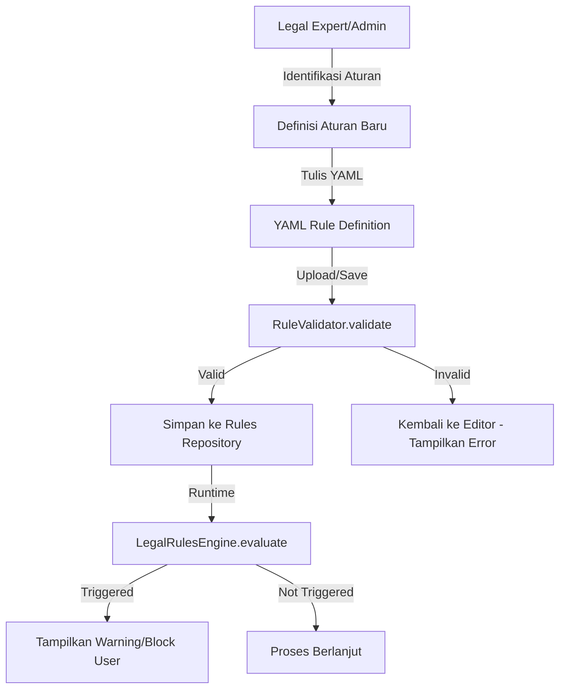

# AI Rule Validation Workflow — Business Process

## 1. Overview

Proses ini menjelaskan bagaimana sebuah aturan hukum atau batasan operasional
diubah menjadi kode digital yang dapat ditegakkan oleh sistem Lawyers Hub.

## 2. Alur Kerja (Workflow)



## 3. Spesifikasi YAML Rule

Setiap aturan harus mengikuti format berikut:

- **rule_id**: `[DOMAIN]-[CATEGORY]-[ID]` (Contoh: `CORP-PRIV-001`)
- **priority**: `CRITICAL`, `HIGH`, `MEDIUM`, `LOW`
- **trigger**: Konteks di mana aturan ini aktif (contoh: `contract_drafting`).
- **action**: Tindakan sistem (`BLOCK`, `WARN`, `ENFORCE_MASKING`).

## 4. Contoh Aturan

```yaml
rule_id: 'CORP-PRIV-001'
name: 'Deteksi Pihak Berisiko Tinggi'
priority: 'CRITICAL'
trigger:
  context: 'contract_drafting'
condition:
  risk_score:
    operator: '>'
    value: 0.8
action:
  type: 'MANDATORY_HUMAN_REVIEW'
  message:
    'Kontrak ini melibatkan entitas dengan risiko tinggi. Diperlukan review
    manual.'
```
