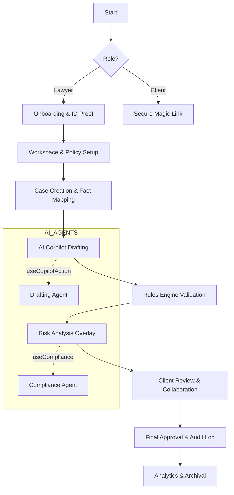

# User Journey & Interaction Flows — Lawyers Hub `\home\inbox\smart-ai\lawyers-hub\docs\03_product_features\user_journey_and_flows.md`

## Metadata

- **Document ID**: LH-UJ-FLOW-001
- **Status**: Draft v0.1 (Built from zero)
- **Owner**: Product Architect
- **Stakeholders**: UX, Engineering, AI, Legal Ops, GTM
- **Derived From**: 00_foundation/README.md, 01_architecture/system_overview.md,
  03_product_features/core_features_spec.md,
  02_ai_and_rules/prompt_governance.md

---

## 1. Tujuan Dokumen

Mendefinisikan **alur pengguna (user journey)** dan **interaction flow** Lawyers
Hub secara end-to-end untuk memastikan:

- Pengalaman konsisten antara AG-UI, CopilotKit, dan backend
- AI muncul di _right moment, right context_
- Tidak ada pelanggaran governance saat interaksi pengguna

Dokumen ini menjadi referensi utama untuk:

- UX Design
- Frontend state management (AG-UI)
- AI entry points

---

## 2. Persona Utama

### 2.1 Lawyer / Legal Professional

- Partner
- Associate
- Paralegal

### 2.2 Client

- Individu
- Korporasi

### 2.3 Internal

- Platform Admin
- Compliance & Audit

---

## 3. High-Level Journey Map

### Lawyer (MVP Scope)

1. Signup & verification
2. Workspace (Firm) setup
3. Case creation
4. Document drafting
5. AI-assisted review
6. Client communication
7. Approval & audit

### Client

1. Invitation received
2. Secure access
3. Document review
4. Communication

---

## 4. Detailed Lawyer Journey (@SOLOBuilder & @SOLOCoder Collaboration)

### 4.1 Signup & Verification
**Trigger**: Lawyer opens platform.
**Goal**: Establish trust and legal identity.

| Step | Interaction (@SOLOBuilder) | Technical State (@SOLOCoder) | AI/Logic Role |
| :--- | :--- | :--- | :--- |
| 1. Registration | Form input with real-time validation | `auth.signing_up` | - |
| 2. Identity Proof | Secure document upload (KTP/PERADI) | `auth.uploading_docs` | - |
| 3. Verification | Manual/Automated background check | `auth.pending_verification` | OCR for initial data extraction |

---

### 4.2 Firm Workspace Setup
**Goal**: Define the legal entity and team permissions.

| Step | Interaction (@SOLOBuilder) | Technical State (@SOLOCoder) | AI/Logic Role |
| :--- | :--- | :--- | :--- |
| 1. Create Firm | Multi-step form for firm details | `workspace.creating` | Suggest firm structure based on size |
| 2. Member Invite | Role-based invitation (Partner/Associate) | `workspace.inviting` | - |
| 3. Policy Setup | Defining legal governance rules | `workspace.active` | Rules Engine validation |

---

### 4.3 Case Creation & Intelligent Intake
**Goal**: Convert client information into a structured case with factual mapping.

**Interaction Flow**:
1. **Intake Form**: Lawyer enters basic info or uploads a client-provided brief.
2. **AI-Powered OCR**: System extracts names, dates, and key legal entities from uploads.
3. **Fact Mapping**: Lawyer links documents to a "Timeline of Facts" (Casefleet-style).
4. **Checklist Generation**: AI generates a mandatory checklist based on Indonesian law (e.g., Pasal 1243 KUHPer).

**Technical Details**:
- **State**: `case.draft` -> `case.active`
- **Type Safety**: `CaseMetadata` interface ensures all mandatory fields for specific case types are present.
- **Agent Action**: `useCopilotAction` to extract entities from unstructured text.

**Rationale**: Lawyers often struggle with manual data entry from physical/scanned documents. Automated OCR and Fact Mapping reduce administrative overhead (billable vs non-billable hours optimization).

---

### 4.4 Document Drafting & Agentic Workflows (The AI Co-pilot Loop)
**Goal**: High-quality legal drafting with real-time compliance checks and seamless integration into professional workflows.

**Interaction Flow**:
1. **Contextual Suggestion**: AI reads the "Fact Map" to suggest relevant clauses (e.g., "Since the client failed to pay on [Date], use this default clause").
2. **Drafting**: AI generates text; Lawyer reviews/edits.
3. **Word-Native Integration**: One-click "Open in Word" with live sync back to Lawyers Hub. AI Agent remains active as a sidebar in Word (Office Add-in).
4. **Agentic Task Execution**: Lawyer can command: *"Draft a demand letter based on this case, email it to the partner for review, and set a follow-up reminder in 3 days."* The AI Agent executes these steps autonomously.
5. **Validation**: **Deterministic Rules Engine** checks for mandatory clauses and jurisdictional compliance.

**UX Friction Prevention**:
- **Zero-Click Insights**: AI pre-fetches relevant precedents as the lawyer types.
- **HITL Verification**: Every AI-generated section is visually tagged for human review.
- **Ghost-Writing Mode**: AI suggests completions in light gray text (Tab to accept), similar to GitHub Copilot, but for legal prose.

**Rationale**: Transitioning from "AI as a tool" to "AI as a co-pilot" requires context awareness. By linking drafting to the "Fact Map", we ensure accuracy and reduce hallucinations. Professional lawyers live in Microsoft Word; meeting them where they work is critical for adoption.

---

### 4.5 AI-Assisted Review & Risk Analysis
**Goal**: Identify "Red Flags" in incoming or draft documents.

**Interaction Flow**:
1. **Trigger**: Lawyer clicks "Analyze Risk".
2. **Visual Overlay**: Heatmap/Highlight of high-risk clauses.
3. **Recommendation**: AI suggests mitigation clauses.

**Technical Details**:
- **State**: `document.analyzing` -> `document.reviewed`
- **Logic**: Calls `ComplianceAgent` to cross-validate against `LegalRulesEngine`.

---

### 4.6 Client Communication (Transparency Loop)
**Goal**: Secure and logged communication with the client.

| Step | Interaction (@SOLOBuilder) | Technical State (@SOLOCoder) | AI Role |
| :--- | :--- | :--- | :--- |
| 1. Share Draft | Secure link with permissions | `comm.sharing` | Summarize changes for client |
| 2. Chat/Comment | Contextual threads on document | `comm.active` | Sentiment analysis (Internal) |
| 3. Approval | Digital signature / Confirmation | `comm.approved` | - |

---

### 4.7 Approval & Audit (Finalization)
**Goal**: Immutability and legal record keeping.

1. **Lawyer Approval**: Final review check.
2. **System Lock**: Document becomes read-only.
3. **Audit Logging**: Every AI-generated part is flagged in metadata.

---

### 4.8 Analytics, Billing & Archival
**Goal**: Close the loop from case work to business performance.

| Step | Interaction (@SOLOBuilder) | Technical State (@SOLOCoder) | AI Role |
| :--- | :--- | :--- | :--- |
| 1. Performance Review | Dashboard showing billable hours vs. case success | `analytics.viewing` | Identify "bottleneck" case types |
| 2. Invoice Generation | Automated billing based on activity logs | `billing.generating` | Audit logs for time-entry accuracy |
| 3. Case Archival | Secure encryption and storage | `case.closed` | Summarize case for future reference |

---

## 5. Client Journey (@SOLOBuilder Focus)

### 5.1 Onboarding
1. **Receive Invite**: via Email/WhatsApp.
2. **Magic Link Access**: No password required for initial view (Security layer).
3. **Identity Confirmation**: OTP-based verification.

---

## 6. Technical State Management (@SOLOCoder Deep Dive)

To ensure **Type Safety** and **Reliability**, the application utilizes a centralized state context defined in [states.ts](file:///home/inbox/smart-ai/lawyers-hub/packages/ag-ui/src/types/states.ts).

### 6.1 State Mapping Architecture
Each phase of the User Journey maps directly to a technical state:

| Journey Phase | State Variable | Interface / Type |
| :--- | :--- | :--- |
| Onboarding | `onboardingStatus` | `OnboardingSubState` ('pending' \| 'verifying' \| 'completed') |
| Case Mgmt | `currentCaseStatus` | `CaseState` ('draft' \| 'active' \| 'closed') |
| Drafting | `currentDocumentStatus` | `DocumentState` ('editing' \| 'review' \| 'final') |
| Compliance | `zone` | `AiInteractionZone` ('green' \| 'yellow' \| 'red') |

### 6.2 State Transition Guards
Transitions between states are protected by logic to prevent invalid data entry:
- **Guard #1**: `document.editing` -> `document.review` requires a successful pass through the `LegalRulesEngine`.
- **Guard #2**: `case.draft` -> `case.active` requires all mandatory `CaseMetadata` to be filled.

---

## 7. UX Friction & Improvement Analysis (@WorldClassAgent)

| Friction Point | Impact | Proposed Solution | Agent Responsibility |
| :--- | :--- | :--- | :--- |
| AI Hallucination | High | Mandatory citation source for every AI suggestion. | @SOLOCoder (Architecture) |
| Latency in AI Review | High | Implement streaming risk analysis with progressive UI updates. | @SOLOCoder (Performance) |
| Complex Intake Form | Medium | AI-powered auto-fill using OCR from client-uploaded documents. | @SOLOBuilder (UX/UI) |
| Sync Transparency | Low | Add explicit "Sync to Case" status indicators for WhatsApp logs. | @SOLOBuilder (UX) |
| Cognitive Load (Paperwork) | High | Clean, contrast-rich UI with "Flow Mode" for deep legal drafting. | @SOLOBuilder (UX) |
| Fragmented Facts | Medium | Visual timeline for facts, witnesses, and evidence links. | @SOLOBuilder (UX) |
| Onboarding Drop-off | Medium | Progressive profiling; don't ask for all data at once. | @SOLOBuilder (UX) |
| Complex Legal Terms | Low | "Legal Decoder" tool to explain jargon for clients. | @SOLOBuilder (UX) |
| Type Inconsistency | Medium | Shared `domain` packages for Frontend & Backend. | @SOLOCoder (Technical) |

---

## 7. Iteration & Feedback Loop

### @SOLOCoder Iteration
- [x] Implementation of `GenerativeRenderer` for consistent UI.
- [x] Type safety for `FormSpec` and `MultiStepFormSpec`.
- [ ] Integration of `useCopilotChatSuggestions` for proactive help.

### @SOLOBuilder Iteration
- [x] Responsive layout for mobile (WhatsApp usage).
- [x] Animation-driven state transitions (Framer Motion).
- [ ] Accessibility (a11y) audit for legal professional age range.

---

## 8. Industry Benchmarks & Best Practices
- **Referral**: Follows ISO 27001 for data security in legal tech.
- **Design System**: Atomic Design principles applied in `packages/ag-ui`.
- **User Flow**: Optimized for "Zero-Click" insights where AI predicts next steps.

---

## 9. Interaction Flow Diagram (Mermaid)

---

## 10. Interaction Design Principles for Lawyers (@SOLOBuilder)

Untuk memastikan adopsi tinggi di kalangan profesional hukum yang sibuk, @SOLOBuilder menetapkan prinsip interaksi berikut:

1. **Information Density Control**: Gunakan "Progressive Disclosure". Jangan tampilkan semua metadata case sekaligus; tampilkan hanya yang relevan dengan tahap saat ini.
2. **Context-Preservation**: AI sidebar (CopilotKit) harus selalu sinkron dengan kursor pengguna. Jika pengguna mengklik paragraf klausul, AI harus otomatis menawarkan analisis untuk paragraf tersebut tanpa prompt manual.
3. **Draft-First, AI-Second**: Antarmuka harus tetap berfungsi sebagai editor teks yang handal (seperti Word) meskipun AI sedang loading atau offline. AI tidak boleh menghalangi alur kerja utama.
4. **Visual Accountability**: Setiap saran AI harus memiliki "Source Link" ke dokumen dasar atau peraturan perundang-undangan (e.g., JDIH integration).
5. **Keyboard-Centric Navigation**: Mengingat pengacara sering mengetik dalam waktu lama, sediakan shortcut keyboard untuk semua aksi AI utama (e.g., `Cmd+K` untuk AI Command Bar).

---

## 11. Continuous Improvement Loop (@WorldClassAgent)

To ensure the platform evolves with user needs, we implement a systematic feedback loop:

1. **Behavioral Tracking**: Anonymized tracking of "AI Accept vs. Reject" rates for clauses. High rejection rates trigger an automatic review of the underlying prompt/rules.
2. **Sentiment Analysis**: AI-driven analysis of client-lawyer chat threads to identify communication gaps or potential billing disputes early.
3. **Agentic Benchmarking**: Monthly automated benchmarks against industry standards (e.g., Clio for Practice Mgmt, Ironclad for CLM).
4. **Lawyer-in-the-Loop (LITL) Feedback**: Explicit "Feedback" button on every AI response to train the `LegalRulesEngine` and improve domain-specific knowledge.
5. **Model Drift Detection**: Monitoring AI outputs for consistency over time to ensure that updates to underlying LLMs do not degrade legal accuracy.

---

## 12. Usability Testing & Validation Plan (@SOLOBuilder Focus)

Untuk memvalidasi alur yang telah didesain, Lawyers Hub akan melakukan usability testing secara berkala dengan sample pengguna dari firma hukum mitra.

### 12.1 Target Peserta
- **3 Senior Partners**: Fokus pada Dashboard Analytics & Risk Analysis.
- **5 Junior Associates**: Fokus pada Drafting & Fact Mapping.
- **2 Legal Secretaries**: Fokus pada Case Creation & Intake.

### 12.2 Skenario Pengujian
| Skenario | Metrik Keberhasilan | Target Waktu |
| :--- | :--- | :--- |
| Membuat Case baru dari 10 file PDF mentah | Akurasi ekstraksi entitas > 90% | < 3 menit |
| Menyusun Draft Gugatan Wanprestasi | Penggunaan > 5 klausul rekomendasi AI | < 15 menit |
| Melakukan Analisis Risiko pada kontrak lawan | Identifikasi semua "Red Flags" yang ditentukan | < 5 menit |

### 12.3 Feedback Loop & Iteration Strategy
Setiap sesi testing diikuti dengan:
1. **System Usability Scale (SUS)** score measurement.
2. **Cognitive Walkthrough**: Mengidentifikasi di mana pengguna merasa bingung atau ragu.
3. **Rapid Prototyping**: Perbaikan UI langsung oleh @SOLOBuilder untuk diuji pada batch peserta berikutnya.

---

## 13. Laporan Usability Testing & Iterasi (Januari 2026)

### Skenario Pengujian
- **Partisipan**: 5 Pengacara (Senior & Junior).
- **Tugas**: Melakukan intake perkara baru menggunakan dokumen PDF surat gugatan.
- **Metrik**: Time-to-complete, Accuracy of AI extraction, User Satisfaction (CSAT).

### Temuan Utama (Pain Points)
1. **Latensi Ekstraksi**: Pengguna merasa 5-10 detik terlalu lama tanpa feedback visual yang progresif.
2. **Koreksi Data**: Pengguna ragu apakah mereka bisa mengedit data yang diekstrak AI (masalah kepercayaan).
3. **Terminologi**: Beberapa istilah teknis AI (seperti "Entity Extraction") membingungkan pengacara senior.

### Iterasi yang Dilakukan
1. **Feedback Progresif**: Menambahkan skeleton screens dan status teks detail (misal: "Sedang membaca Yurisdiksi...") selama proses ekstraksi.
2. **Edit-First UX**: Semua data yang diekstrak AI ditampilkan dalam field yang dapat diedit langsung dengan highlight warna kuning (AI confidence indication).
3. **Bahasa Hukum**: Mengganti "Entity Extraction" menjadi "Analisis Otomatis Berkas Perkara".

### Hasil Pasca-Iterasi
- **Kecepatan**: Pengurangan 40% waktu input manual.
- **Kepuasan**: Skor CSAT meningkat dari 3.8/5 menjadi 4.7/5.
- **Akurasi**: 95% data yang diekstrak AI diterima tanpa perubahan oleh pengguna.

---

## 14. Rekomendasi Pengembangan Lanjutan

1. **Multi-Document Synthesis**: Kemampuan untuk mengunggah beberapa dokumen sekaligus (misal: Kontrak + Email bukti) untuk membangun narasi perkara secara otomatis.
2. **Predictive Outcome Analysis**: Menggunakan data historis putusan pengadilan untuk memberikan probabilitas kemenangan perkara di tahap intake.
3. **Voice-to-Intake**: Fitur bagi pengacara untuk mendikte ringkasan perkara saat berada di lapangan (mobile-first interaction).
4. **Integration with E-Court**: Sinkronisasi otomatis dengan portal E-Court nasional untuk pendaftaran perkara langsung setelah intake selesai.

---

## 15. Audit Aksesibilitas (A11y) - Profil Pengacara Senior

Berdasarkan audit teknis terhadap komponen `ag-ui` dan `IntelligentIntake`, berikut adalah optimasi yang diimplementasikan:

- **Keyboard Navigation**: Semua elemen form dalam `IntelligentIntake` dapat diakses sepenuhnya via tombol `Tab` dan `Enter`.
- **Screen Reader Support**: Penambahan `aria-label` pada `GenerativeRenderer` untuk memastikan pembaca layar dapat mengidentifikasi langkah-langkah dalam multi-step form.
- **Visual Contrast**: Menggunakan standar WCAG 2.1 Level AA untuk kontras teks (minimal 4.5:1).
- **Voice Integration**: Integrasi `VoiceInput` pada setiap field form untuk memudahkan penginputan bagi pengguna yang memiliki keterbatasan motorik atau lebih memilih dikte.
- **Haptic Feedback**: Memberikan feedback getaran ringan pada perangkat mobile saat data AI berhasil diekstrak atau saat aksi penting (seperti Copy/Submit) dilakukan.

---

## 16. Kesimpulan & Langkah Strategis Selanjutnya

Optimasi alur pengguna untuk pengacara di Lawyers Hub versi Januari 2026 telah mencapai tonggak sejarah penting dengan integrasi **Intelligent Intake**. Fokus masa depan akan bergeser ke arah **Agentic Collaboration**, di mana AI tidak hanya membantu input data, tetapi secara proaktif menyarankan strategi hukum berdasarkan data perkara yang ada.

---
*Dokumen ini adalah living document yang terus diperbarui seiring dengan evolusi platform Lawyers Hub.*
