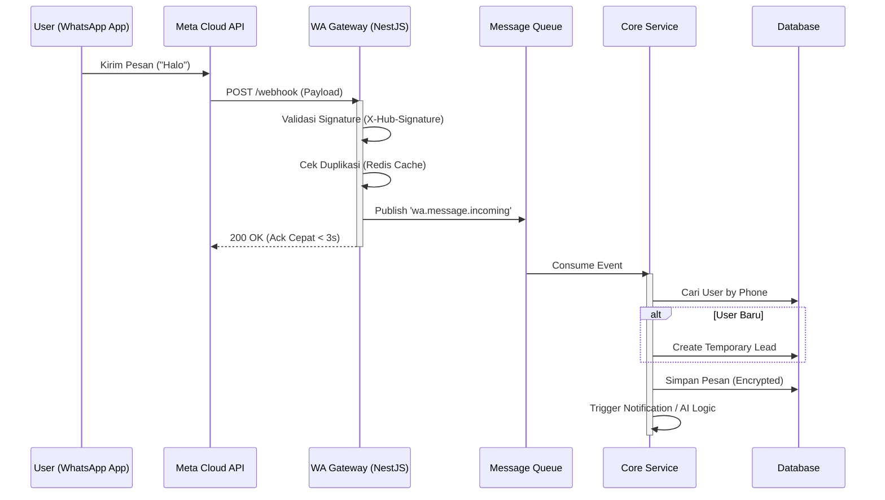
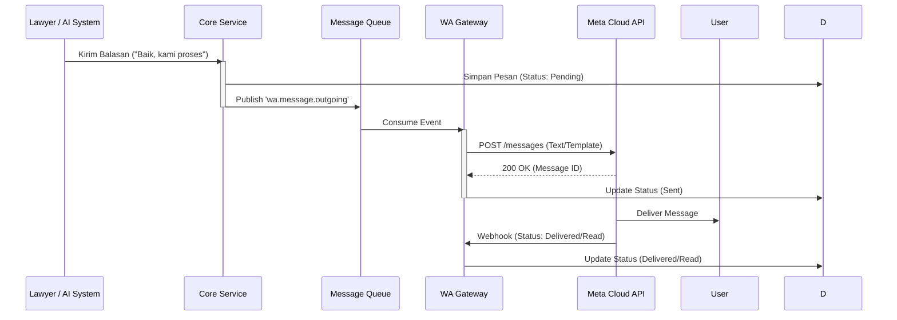

# Diagram Sequence Inbound & Outbound

## 1. Inbound Message Flow (Pesan Masuk)

Alur ketika klien mengirim pesan ke nomor WhatsApp bisnis. Fokus pada
_responsivitas webhook_ dan _pemrosesan asinkron_.

## 2. Outbound Message Flow (Pesan Keluar)

Alur ketika Lawyer membalas melalui Dashboard atau AI mengirim respon otomatis.

## 3. Penanganan Status (Status Callback)

Penting untuk melacak status pesan (Sent -> Delivered -> Read) untuk kepastian
hukum (bahwa klien sudah menerima informasi).

1. **Sent**: Diterima server Meta.
2. **Delivered**: Masuk ke HP User.
3. **Read**: Dibuka oleh User (jika Read Receipt aktif).

> **Catatan Compliance**: Jangan berasumsi pesan terbaca jika status hanya
> "Delivered". Untuk notifikasi hukum penting, pertimbangkan konfirmasi manual
> dari user.
