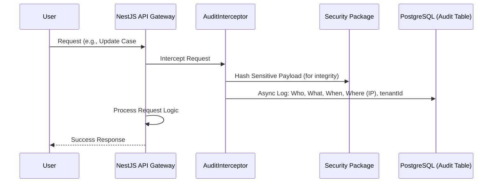
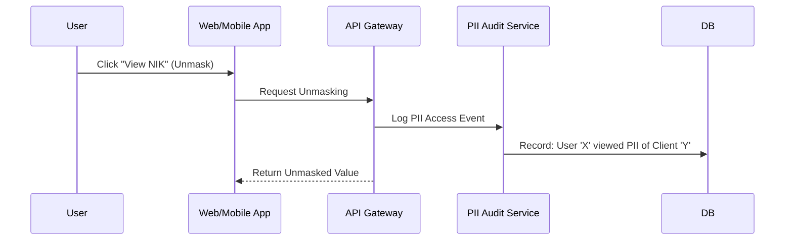

# 📜 Compliance & Audit Logging Flow

Ensuring a tamper-proof audit trail is a core requirement for legal tech compliance (ISO 27001, UU PDP).

## 1. Automated Audit Interceptor Flow

Every write operation (POST, PUT, DELETE) and sensitive read operation is intercepted by the global `AuditInterceptor`.

### Logged Metadata:
- **Who**: `userId` and `tenantId` extracted from JWT.
- **What**: Endpoint, HTTP Method, Request Body (Masked), and Response Status.
- **When**: Precise timestamp (UTC).
- **Where**: Source IP Address and User-Agent.
- **Integrity**: Each log entry contains a cryptographic hash of the previous entry to prevent tampering (Chained Audit Trail).

## 2. PII Access Logging

When a user views sensitive client data (unmasking), a specific `PII_ACCESS` log is generated.

## 3. Compliance Reporting
- **Automated Alerts**: The SRE team is notified if more than 10 RLS violations occur within a minute for a specific IP.
- **Retention**: Audit logs are retained for 10 years as per legal regulatory requirements.
- **Immutability**: Once written to the `audit_logs` table, entries cannot be modified or deleted, even by system administrators (enforced by DB triggers).
