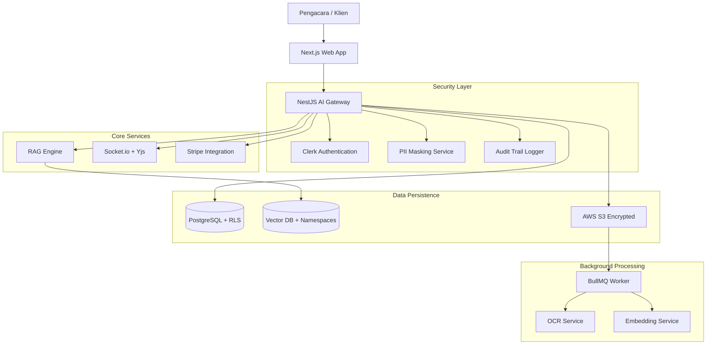

# Project Plan V2: Lawyers Hub

## 1. Spesifikasi Teknis Detail

### Requirements

- **Multi-tenancy**: Data isolation at DB level (RLS) and Vector level
  (Namespaces).
- **Security**: PII masking with >98% coverage for Indonesian legal data.
- **Real-time**: Collaborative editing with conflict resolution (CRDT).
- **Scalability**: Microservices-ready backend with BullMQ for heavy tasks (OCR,
  RAG).

### Constraints

- Minimal latency for AI responses (<3s).
- Compliance with UU PDP No. 27/2022.
- 100% audit trail for sensitive document access.

### Dependencies

- **Frameworks**: Next.js 14, NestJS, Turborepo.
- **ORM**: Prisma.
- **Auth**: Clerk.
- **AI**: OpenAI/Anthropic, LangChain.
- **Security**: Microsoft Presidio (logic), CryptoJS.

## 2. Diagram Arsitektur Sistem

## 3. Timeline Pengembangan & Milestones

| Milestone                 | Target Date | Deliverables                                         |
| :------------------------ | :---------- | :--------------------------------------------------- |
| **M1: Foundation**        | 2026-01-15  | Multi-tenancy RLS, Auth, Monorepo Setup.             |
| **M2: Security & RAG**    | 2026-01-30  | PII Masking, Hierarchical RAG, OCR Worker.           |
| **M3: Collaboration**     | 2026-02-15  | Yjs Real-time Editing, Case Management UI.           |
| **M4: Commerce & Launch** | 2026-02-28  | Stripe Integration, Beta Testing, Production Deploy. |

## 4. Kriteria Penerimaan (Acceptance Criteria)

1. **Functional**:
    - Pengguna hanya bisa melihat data milik tenant mereka sendiri.
    - PII (NIK, Nama, Alamat) tersensor sebelum dikirim ke LLM.
    - Dokumen bisa diedit bersamaan tanpa konflik data.
2. **Performance**:
    - Lighthouse score > 90 untuk Performance & SEO.
    - API response time < 200ms (exclude AI generation).
3. **Security**:
    - Penetration testing tidak menemukan celah IDOR.
    - Audit log mencatat setiap aksi baca/tulis dokumen.

## 5. Setup & Verification Procedures

### Database RLS Setup

To ensure multi-tenancy isolation at the database level:

1. **Execution**: Run `npm run db:setup-rls` in `packages/database`.
2. **Prerequisite**: PostgreSQL must be accessible with `DATABASE_URL`
    configured.
3. **Verification**:
    - Execute `SELECT * FROM pg_policies;` to confirm policies for all tables.
    - Test isolation:
      `SET app.current_tenant = 'uuid'; SELECT * FROM documents;` should only
      return tenant data.

### RAG & Embedding Integration

Transitioning from mock to live embeddings:

1. **Service**: `EmbeddingService` in `@lawyers-hub/copilot`.
2. **Provider**: OpenAI `text-embedding-3-small` (Recommended for
    cost/performance).
3. **Security**: API keys managed via environment variables; PII masking
    enforced before embedding.

### Monitoring & Quality Control

1. **Metrics**: Prometheus instrumentation in `LegalRulesEngine` (latency,
    compliance rate).
2. **E2E Testing**: Playwright tests for real-time collaboration and RAG
    accuracy.
3. **Static Analysis**: ESLint and SonarQube for code quality gates.

## 6. Role-Specific Tasks (SOLO Agents)
