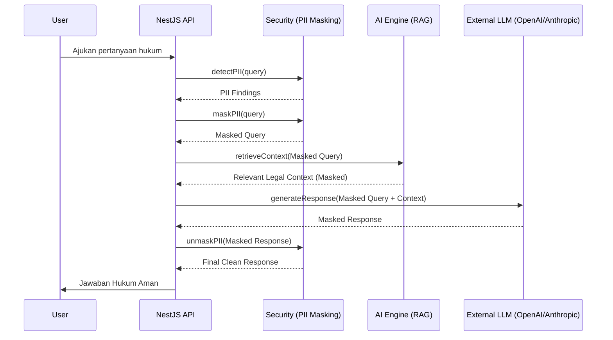

# Arsitektur Sistem Lawyers Hub

## 1. Overview
Lawyers Hub menggunakan arsitektur monorepo berbasis Turborepo dengan fokus pada keamanan data (UU PDP No. 27/2022) dan skalabilitas AI (RAG).

## 2. High-Level Architecture
```mermaid
graph TD
    subgraph Frontend
        Web[Next.js Web App]
    end
    
    subgraph Backend_Services
        API[NestJS API Gateway]
        Worker[BullMQ Workers]
    end
    
    subgraph Shared_Packages
        Security[@lawyers-hub/auth - PII Masking]
        AI[@lawyers-hub/copilot - RAG Engine]
        DB[@lawyers-hub/database - Prisma RLS]
    end
    
    subgraph Data_Storage
        Postgres[(PostgreSQL + RLS)]
        Redis[(Redis - Queue/Cache)]
        VectorDB[(Vector Store - Milvus/Pinecone)]
    end

    Web --> API
    API --> Security
    API --> AI
    API --> DB
    Worker --> AI
    AI --> VectorDB
    DB --> Postgres
    API --> Redis
```

## 3. Alur RAG dengan PII Masking (UML Sequence)


## 4. Multi-tenancy dengan Row Level Security (RLS)
Sistem menggunakan `tenant_id` pada setiap tabel sensitif. Kebijakan RLS di PostgreSQL memastikan:
1. Setiap query menyertakan `current_setting('app.current_tenant_id')`.
2. User hanya dapat melihat data milik organisasinya sendiri.
3. Admin sistem memiliki akses bypass terbatas untuk audit.

## 5. Kepatuhan UU PDP No. 27/2022
- **Data Minimization**: PII di-masking sebelum keluar ke layanan pihak ketiga.
- **Audit Trail**: Setiap deteksi dan masking dicatat dalam `PIIAuditLog`.
- **Reporting**: Sistem siap menghasilkan laporan insiden data dalam 72 jam jika terjadi pelanggaran.
