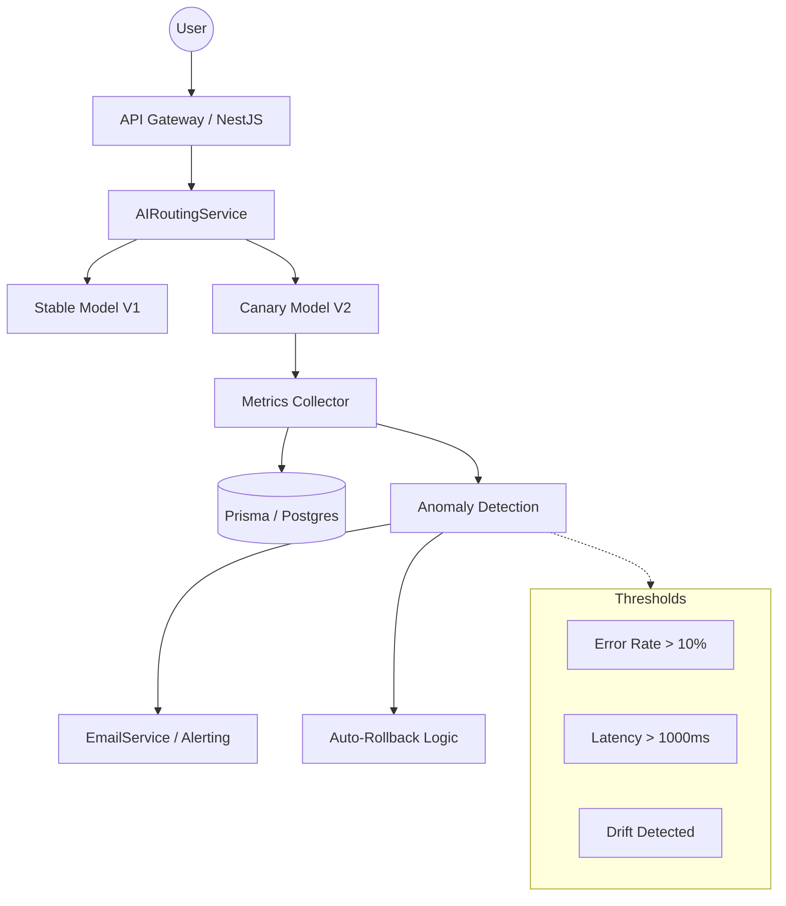

# Technical Specification: AI Canary Monitoring & Compliance System

## 1. Overview
Sistem ini dirancang untuk memantau performa model AI (Canary) secara real-time, memberikan peringatan otomatis (Alerting), dan memastikan kepatuhan terhadap regulasi perlindungan data (UU PDP/GDPR) melalui deteksi dan masking PII.

## 2. Technical Architecture

### 2.1 Canary Monitoring Flow


### 2.2 PII Compliance Flow
```mermaid
graph LR
    Input[Raw Legal Document] --> Detector[PII Detector]
    Detector --> Policy[Policy Engine - UU PDP]
    Policy --> Masker[Adaptive Masking]
    Masker --> AI[AI Model Processing]
    AI --> Output[Anonymized Result]
    
    subgraph PII Types
        NIK[NIK / ID Card]
        PH[Phone Number]
        EM[Email Address]
        AC[Account Number]
    end
    Detector -.-> PII Types
```

## 3. Core Specifications

### 3.1 AI Metrics & Alerting
| Metric | Threshold | Action |
| :--- | :--- | :--- |
| Error Rate | > 10% (30 min) | Send Critical Alert |
| Latency (p95) | > 1500ms | Send Warning Alert |
| Model Drift | Statistical Sig. | Notify Data Scientist |
| Auto-Rollback | Error > 15% OR Latency > 2s | Trigger Immediate Rollback |

### 3.2 Compliance (UU PDP)
- **Masking Strategy**: Replace sensitive data with tags (e.g., `[MASKED_NIK]`).
- **Data Lineage**: Log every AI interaction with anonymized metadata.
- **Audit Trail**: Simpan log audit di tabel `AuditLog` untuk keperluan forensik/regulasi.

## 4. Roadmap & Milestones

### Milestone 1: Stability & Monitoring (Current)
- [x] Fix build errors (Next.js 16)
- [x] Implement basic Canary monitoring
- [x] Multi-recipient email alerts

### Milestone 2: Advanced AI Ops (Next)
- [ ] Implement Latency thresholds & PII checks
- [ ] Dynamic Canary Prompts for drift detection
- [ ] Dashboard visual updates for drift analysis

### Milestone 3: Full Compliance & Scaling
- [ ] Integration with External PII Detection API (optional)
- [ ] Scalable monorepo workflow optimization
- [ ] Full system integration testing

## 5. Quality Control & Versioning

### 5.1 Static Code Analysis
- **Linter**: ESLint v9 dengan flat config (`eslint.config.js`).
- **Formatter**: Prettier untuk konsistensi gaya kode.
- **Strict Rules**: 
  - `@typescript-eslint/no-unused-vars`: Error.
  - `@typescript-eslint/no-explicit-any`: Warning (Target: 0 any in Milestone 3).

### 5.2 Branching Strategy (Git Flow)
- `main`: Produksi, hanya merge dari `develop`.
- `develop`: Integrasi fitur, basis untuk branch baru.
- `feature/*`: Pengembangan fitur baru.
- `fix/*`: Perbaikan bug mendesak.

## 6. Acceptance Criteria
1. **Performance**: API response time < 200ms (excluding AI processing).
2. **Accuracy**: PII detection F1-score > 0.90.
3. **Reliability**: Auto-rollback berfungsi dalam < 1 menit setelah threshold terlampaui.
4. **Compliance**: Tidak ada PII yang bocor ke log server atau model provider luar.
