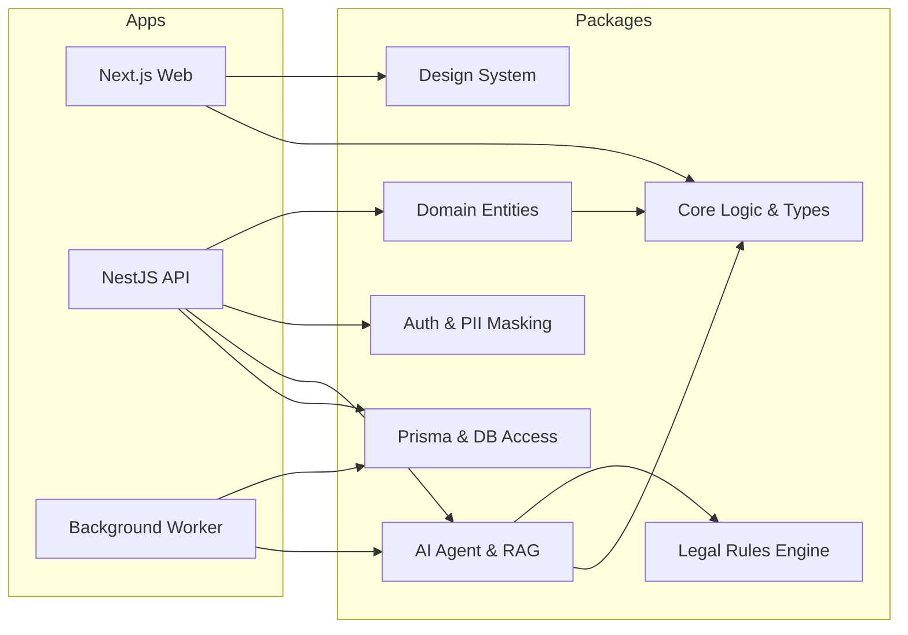
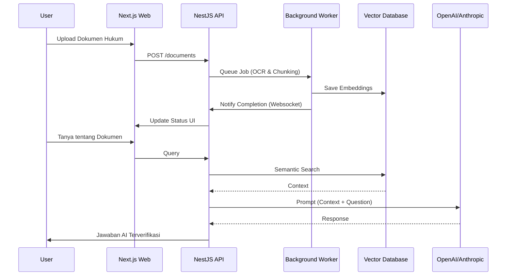
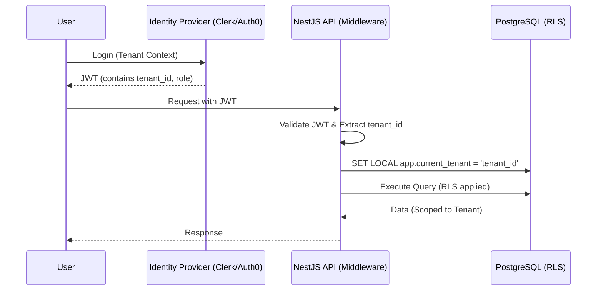
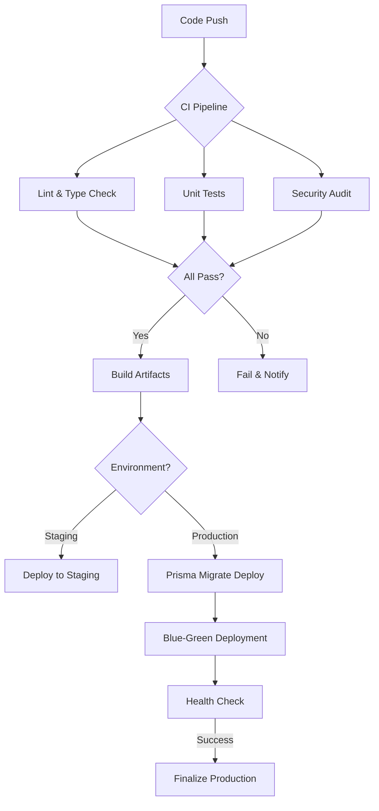

# Rancangan & Persiapan Mendalam: AI-Assisted Legal SaaS (Production-Ready)

Dokumen ini mendefinisikan arsitektur sistem berbasis
**Turborepo + Next.js + NestJS** yang dirancang untuk skala produksi, mendukung
multi-tenancy, mengintegrasikan komponen AI canggih, dan mengikuti prinsip
Clean Architecture.

---

## 1. Context Understanding

- **Problem Summary**: Membangun fondasi teknis yang kokoh untuk platform Legal
  SaaS yang dapat berevolusi dari layanan Q&A publik menjadi alat profesional.
- **Key Objectives**: Menjamin keamanan data hukum, isolasi tenant, skalabilitas
  AI, dan maintainability melalui Clean Architecture.

---

## 2. Prinsip Arsitektur (Clean Architecture & SOLID)

Sistem dibagi menjadi lapisan-lapisan yang memiliki tanggung jawab tunggal
(Single Responsibility) untuk memastikan *testability*.

- **Enterprise Business Rules (Domain)**: Entitas dan logika bisnis inti hukum
  (Pure TS, No Dependencies).
- **Application Business Rules (Use Cases)**: Orkestrasi aliran data.
- **Interface Adapters**: Controller (API), Presenters (UI), Gateways.
- **Frameworks & Drivers**: NestJS, Next.js, Prisma, AI Engine.

> **Testability**: Arsitektur ini memungkinkan Unit Testing pada lapisan Domain,
> Integration Testing pada Use Cases, dan E2E Testing pada level API.

---

## 3. Struktur Monorepo (Turborepo)

```text
lawyers-hub/
├─ apps/
│  ├─ web/                  # Next.js (Public Q&A + Dashboard)
│  ├─ api/                  # NestJS (Backend Core & AI Orchestrator)
│  └─ worker/               # NestJS/Node (Background jobs)
│
├─ packages/
│  ├─ core/                 # Shared logic: constants, utils
│  ├─ domain/               # Pure domain entities & interfaces
│  ├─ database/             # Prisma client & repositories
│  ├─ ui/                   # Design System (Tailwind + Shadcn/ui)
│  ├─ security/             # Auth logic, RBAC, PII masking
│  ├─ ai/                   # RAG Engine, Agent definitions
│  ├─ observability/        # Centralized logging, Tracing
│  └─ config/               # Shared TSConfig, ESLint
│
├─ turbo.json               # Pipeline & caching strategy
└─ docker-compose.yml       # Local development services
```

---

## 4. Strategi Multi-Tenancy & Keamanan

Untuk industri hukum, isolasi data adalah harga mati.

### 4.1 Isolasi Data & Resource

- **Database (Logical Isolation)**: Menggunakan `tenant_id` pada setiap tabel
  dengan *Row Level Security (RLS)* di PostgreSQL.
- **Dynamic Connection Pooling**: NestJS middleware yang menyuntikkan `tenant_id`
  ke dalam Prisma context.
- **Storage (S3/GCS)**: Isolasi level bucket atau folder prefix per tenant.
- **Cache (Redis)**: Penggunaan key prefixing per tenant.

### 4.2 Autentikasi & Otorisasi (RBAC)

- **Identity Provider**: Integrasi dengan Clerk atau Auth0.
- **Multi-Level RBAC**:
  - `Public User`: Akses Q&A publik.
  - `Lawyer`: Akses case management, AI drafting.
  - `Firm Admin`: Manajemen anggota, billing, audit logs.
  - `Super Admin`: Platform monitoring.

### 4.3 Kepatuhan (Compliance)

- **Encryption**: AES-256 untuk data sensitif, TLS 1.3 in-transit.
- **PII Masking**: Komponen di `packages/auth` yang menyamarkan identitas
  sebelum dikirim ke LLM.

---

## 5. Integrasi AI & Pengolahan Dokumen Hukum

AI bukan sekadar fitur, tapi inti dari operasional.

### 5.1 RAG (Retrieval-Augmented Generation) Pipeline

1. **Ingestion**: Dokumen hukum diunggah -> OCR.
2. **Chunking & Embedding**: Pemecahan teks -> OpenAI/Cohere Embeddings.
3. **Vector Storage**: Simpan ke Pinecone atau pgvector.
4. **Retrieval**: Mencari konteks hukum yang relevan.
5. **Generation**: LLM menghasilkan jawaban berdasarkan konteks.

### 5.2 Legal Rules Engine (Deterministic Fallback)

AI divalidasi oleh `packages/rules-engine` yang berisi logika hukum deterministik
untuk mengurangi halusinasi.

### 5.3 AI Governance & Compliance

- **Human-in-the-loop (HITL)**: Verifikasi manual oleh ahli hukum.
- **Explainability**: Setiap jawaban AI menyertakan referensi pasal.
- **Document Lifecycle Management**:
  - **Retention Policy**: Penghapusan dokumen otomatis sesuai regulasi.
  - **Audit Trail**: Pencatatan lengkap akses dan revisi.

---

## 6. Operasional & Production-Readiness

### 6.1 Infrastruktur & Skalabilitas

- **Frontend**: Deployment di Vercel atau Self-hosted menggunakan **Nginx**.
- **Backend**: Containerized (Docker) di AWS ECS/EKS.
- **Caching & Performance**:
  - **Redis**: Session management dan caching hasil RAG.
  - **Turbopack & Chunking**: Optimalisasi build.

### 6.2 Monitoring & Logging

- **Logging**: Winston/Pino mengirim log ke ELK Stack.
- **Error Tracking**: Sentry untuk exception di frontend dan backend.
- **Metrics**: Prometheus & Grafana untuk latensi API.

### 6.3 Resilience & Error Handling

- **Circuit Breaker**: Implementasi pola Circuit Breaker untuk integrasi LLM.
- **Retry Mechanism**: Exponential backoff untuk job di Background Worker.
- **Graceful Shutdown**: Memastikan semua koneksi DB dan job selesai.

### 6.4 Backup & Disaster Recovery

- **Database Backup**: Automated daily snapshot dan PITR.
- **Multi-Region Strategy**: Replika database di region berbeda.

---

## 7. Roadmap Pengembangan & Evolusi

| Fase | Fokus | Fitur Kunci | Arsitektur & Migrasi |
| :--- | :--- | :--- | :--- |
| **P1** | Speed & SEO | Chatbot, Artikel | Monorepo Base, Basic RAG. |
| **P2** | Productivity | Workspace, AI Draft | Multi-tenancy. **Migrasi**. |
| **P3** | Security | SSO, Audit Log | Microservices. **Versi**. |

---

## 8. Strategi Testing & Kualitas

- **Unit Testing**: Minimal 80% coverage pada domain dan rules.
- **Integration Testing**: Testing alur API NestJS dengan database test.
- **E2E Testing**: Playwright untuk alur kritis.
- **AI Evaluation**: Framework RAGAS untuk akurasi jawaban.

---

## 9. Pipeline CI/CD & Automasi

Pipeline memastikan setiap perubahan kode aman untuk dideploy.

- **Continuous Integration (CI)**:
  - **Turbo Cache**: Mempercepat build di GitHub Actions.
  - **Lint & Type Check**: Memastikan kepatuhan standar.
  - **Security Audit**: Menggunakan `npm audit` dan Snyk.
  - **Automated Testing**: Menjalankan unit & integration tests.

- **Continuous Deployment (CD)**:
  - **Staging Environment**: Deployment otomatis ke environment staging.
  - **Blue-Green Deployment**: Strategi deployment tanpa downtime.
  - **Prisma Migrations**: Sinkronisasi schema DB via pipeline CD.

---

## 10. Diagram Alur (Mermaid)

### 10.1 Arsitektur Komponen Monorepo



### 10.2 Alur Pemrosesan Dokumen Hukum



### 10.3 Autentikasi & Otorisasi Multi-Tenant



### 10.4 Pipeline CI/CD (GitHub Actions)



---

## 11. Integrasi Teknis & Developer Experience (DX)

- **Shared Validation (Zod)**: Skema validasi didefinisikan di `packages/core`.
- **Type-Safe API Client**: tRPC atau otomatisasi generator OpenAPI.
- **Unified Error Handling**: Kelas error kustom di `packages/core`.

## 12. Kesimpulan & Decision Making

Keputusan pemilihan stack dan arsitektur didasarkan pada:

1. **Scalability**: NestJS memberikan struktur backend solid.
2. **Speed of Development**: Turborepo memangkas waktu build.
3. **Legal Compliance**: PostgreSQL RLS dan PII masking.
4. **Reliability**: Pemisahan AI Agent dari Rules Engine.
