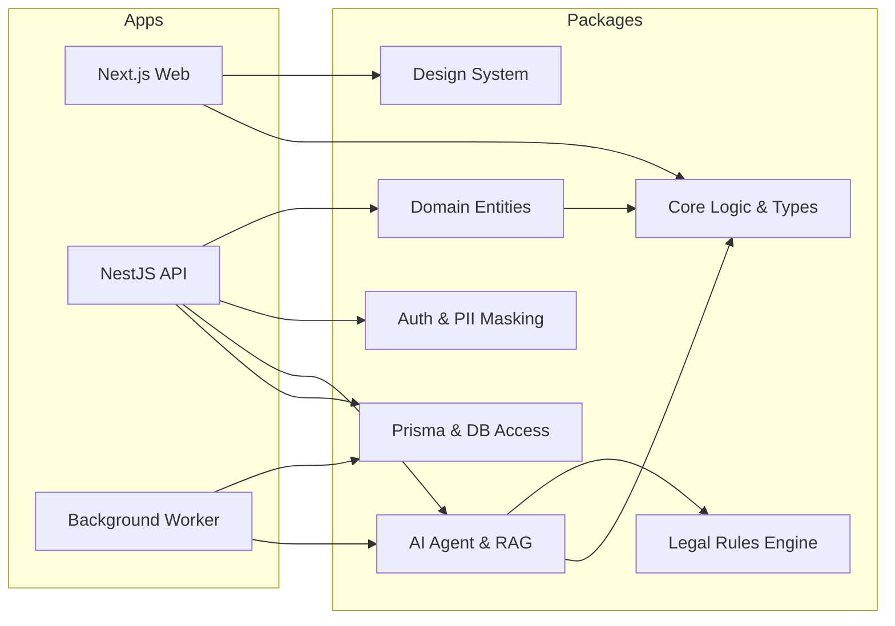
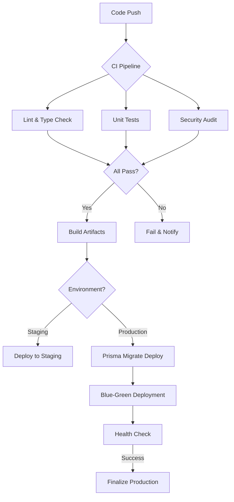

# Rancangan & Persiapan Mendalam: AI-Assisted Legal SaaS (Production-Ready)

Dokumen ini mendefinisikan arsitektur sistem berbasis **Turborepo + Next.js + NestJS** yang dirancang untuk skala produksi, mendukung multi-tenancy, mengintegrasikan komponen AI canggih, dan mengikuti prinsip Clean Architecture.

---

### 1. Context Understanding
- **Problem Summary**: Membangun fondasi teknis yang kokoh untuk platform Legal SaaS yang dapat berevolusi dari layanan Q&A publik menjadi alat profesional pengacara hingga solusi korporat.
- **Key Objectives**: Menjamin keamanan data hukum, isolasi tenant, skalabilitas AI, dan maintainability melalui Clean Architecture.

---

### 2. Prinsip Arsitektur (Clean Architecture & SOLID)

Sistem dibagi menjadi lapisan-lapisan yang memiliki tanggung jawab tunggal (Single Responsibility) untuk memastikan *testability* dan kemudahan perubahan.

- **Enterprise Business Rules (Domain)**: Entitas dan logika bisnis inti hukum (Pure TS, No Dependencies).
- **Application Business Rules (Use Cases)**: Orkestrasi aliran data. Menggunakan **Dependency Injection (DI)** untuk menyuntikkan repository interfaces, memudahkan *mocking* saat testing.
- **Interface Adapters**: Controller (API), Presenters (UI), Gateways (DB/External Services).
- **Frameworks & Drivers**: NestJS (sebagai DI Container), Next.js, Prisma, AI Engine.

> **Testability**: Arsitektur ini memungkinkan Unit Testing pada lapisan Domain tanpa framework, Integration Testing pada Use Cases dengan mock repository, dan E2E Testing pada level API.

---

### 3. Struktur Monorepo (Turborepo)

```text
lawyers-hub/
├─ apps/
│  ├─ web/                  # Next.js (Public Q&A + Professional Dashboard)
│  ├─ api/                  # NestJS (Backend Core & AI Orchestrator)
│  └─ worker/               # NestJS/Node (Background jobs: OCR, Document Processing)
│
├─ packages/
│  ├─ core/                 # Shared logic: constants, utils, custom errors
│  ├─ domain/               # Pure domain entities & interfaces (Clean Architecture)
│  ├─ database/             # Prisma client, migrations, & tenant-aware repositories
│  ├─ ui/                   # Design System (Tailwind + Shadcn/ui)
│  ├─ security/             # Auth logic, RBAC, PII masking, encryption
│  ├─ ai/                   # RAG Engine, Prompt templates, Agent definitions
│  ├─ observability/        # Centralized logging (Winston), Tracing (OpenTelemetry)
│  └─ config/               # Shared TSConfig, ESLint, Jest configs
│
├─ turbo.json               # Pipeline & caching strategy
└─ docker-compose.yml       # Local development services (DB, Redis, VectorDB)
```

---

### 4. Strategi Multi-Tenancy & Keamanan

Untuk industri hukum, isolasi data adalah harga mati.

#### 4.1 Isolasi Data & Resource
- **Database (Logical Isolation)**: Menggunakan `tenant_id` pada setiap tabel utama dengan *Row Level Security (RLS)* di PostgreSQL untuk mencegah kebocoran data antar tenant.
- **Dynamic Connection Pooling**: NestJS middleware yang menyuntikkan `tenant_id` ke dalam Prisma context pada setiap request.
- **Storage (S3/GCS)**: Isolasi level bucket atau folder prefix per tenant (misal: `bucket-name/tenant-uuid/docs/...`) dengan signed URL yang divalidasi oleh backend.
- **Cache (Redis)**: Penggunaan key prefixing per tenant (`tenant-uuid:cache-key`) untuk mencegah tabrakan data cache.

#### 4.2 Autentikasi & Otorisasi (RBAC)
- **Identity Provider**: Integrasi dengan Clerk atau Auth0 untuk manajemen user skala produksi.
- **Multi-Level RBAC**: 
  - `Public User`: Akses Q&A publik.
  - `Lawyer`: Akses case management, AI drafting.
  - `Firm Admin`: Manajemen anggota, billing, audit logs.
  - `Super Admin`: Platform monitoring.

#### 4.3 Kepatuhan (Compliance)
- **Encryption**: AES-256 untuk data sensitif di DB, TLS 1.3 untuk data in-transit.
- **PII Masking**: Komponen di `packages/security` yang secara otomatis menyamarkan nama/identitas dalam dokumen sebelum dikirim ke LLM (GDPR/Compliance).

---

### 5. Integrasi AI & Pengolahan Dokumen Hukum

AI bukan sekadar fitur, tapi inti dari operasional.

#### 5.1 RAG (Retrieval-Augmented Generation) Pipeline
1. **Ingestion**: Dokumen hukum (PDF/Docx) diunggah -> OCR (Tesseract/Azure Form Recognizer).
2. **Chunking & Embedding**: Pemecahan teks menjadi chunk yang bermakna -> OpenAI/Cohere Embeddings.
3. **Vector Storage**: Simpan ke Pinecone atau pgvector untuk pencarian semantik.
4. **Retrieval**: Mencari konteks hukum yang relevan berdasarkan query user.
5. **Generation**: LLM menghasilkan jawaban berdasarkan konteks + *Legal Rules Engine*.

#### 5.2 Legal Rules Engine (Deterministic Fallback)
AI divalidasi oleh `packages/rules` yang berisi logika hukum deterministik (misal: syarat usia pernikahan, tenggat waktu banding) untuk mengurangi halusinasi.

#### 5.3 AI Governance & Compliance
- **Human-in-the-loop (HITL)**: Fitur verifikasi manual oleh ahli hukum untuk hasil drafting dokumen AI sebelum dianggap final.
- **Explainability**: Setiap jawaban AI harus menyertakan referensi pasal atau dokumen sumber yang ditemukan dalam RAG.
- **Document Lifecycle Management**: 
  - **Retention Policy**: Penghapusan dokumen otomatis sesuai regulasi hukum (misal: 10 tahun) atau permintaan tenant (Right to be Forgotten).
  - **Audit Trail**: Pencatatan lengkap siapa yang mengakses dokumen, kapan AI memprosesnya, dan revisi apa yang dilakukan manusia.

---

### 6. Operasional & Production-Readiness

#### 6.1 Infrastruktur & Skalabilitas
- **Frontend**: Deployment di Vercel (Edge Functions) untuk performa global atau Self-hosted menggunakan **Nginx** sebagai reverse proxy untuk menangani SSL termination dan caching statis.
- **Backend**: Containerized (Docker) di AWS ECS/EKS atau Google Cloud Run. Jika menggunakan VPS tradisional, gunakan **PM2** untuk process management agar aplikasi auto-restart saat crash.
- **Caching & Performance**: 
  - **Redis**: Session management dan caching hasil RAG.
  - **Turbopack & Chunking**: Optimalisasi build menggunakan Turbopack (di Next.js) dan strategi *code-splitting/chunking* untuk memastikan *Initial Load Time* tetap rendah meskipun aplikasi bertambah besar.

#### 6.2 Monitoring & Logging
- **Logging**: Winston/Pino mengirim log ke ELK Stack atau Datadog.
- **Error Tracking**: Sentry untuk menangkap exception di frontend dan backend secara real-time.
- **Metrics**: Prometheus & Grafana untuk memantau latensi API dan penggunaan token AI.

#### 6.3 Resilience & Error Handling
- **Circuit Breaker**: Implementasi pola Circuit Breaker (misal: menggunakan `resilience4js` atau logic custom di NestJS) untuk integrasi LLM. Jika API LLM down, sistem memberikan fallback jawaban dari cache atau Rules Engine.
- **Retry Mechanism**: Exponential backoff untuk job di Background Worker (OCR/Embedding) guna menangani kegagalan transient pada API eksternal.
- **Graceful Shutdown**: Memastikan semua koneksi DB dan job yang berjalan selesai dengan benar sebelum proses backend dimatikan (SIGTERM handling).

#### 6.4 Backup & Disaster Recovery
- **Database Backup**: Automated daily snapshot dan Point-in-Time Recovery (PITR) pada PostgreSQL.
- **Multi-Region Strategy**: (Enterprise) Replika database di region berbeda untuk meminimalisir downtime saat terjadi kegagalan infrastruktur skala besar.

---

### 7. Roadmap Pengembangan & Evolusi

| Fase | Fokus | Fitur Kunci | Arsitektur & Strategi Migrasi |
| :--- | :--- | :--- | :--- |
| **Phase 1: Public Q&A** | Kecepatan & SEO | Chatbot Hukum, Artikel, SEO Optimization | Monorepo Base, Basic RAG. Skema DB awal. |
| **Phase 2: Pro Tools** | Productivity | Case Workspace, AI Drafting, OCR | Multi-tenancy. **Migrasi Data**: Skrip migrasi untuk memindahkan data Q&A publik ke dalam struktur tenant-aware. |
| **Phase 3: Enterprise** | Security & Integration | SSO, Advanced Audit Log, API Access | Microservices (optional). **Backward Compatibility**: API Versioning (v1, v2) untuk mendukung integrasi pihak ketiga tanpa breaking changes. |

---

### 8. Strategi Testing & Kualitas

- **Unit Testing**: Minimal 80% coverage pada `packages/domain` dan `packages/rules`.
- **Integration Testing**: Testing alur API NestJS dengan database test (Prisma).
- **E2E Testing**: Playwright untuk alur kritis (misal: pengunggahan dokumen hingga hasil analisis AI keluar).
- **AI Evaluation**: Menggunakan framework seperti RAGAS untuk mengukur akurasi dan relevansi jawaban AI.

---

### 9. Pipeline CI/CD & Automasi

Pipeline dirancang untuk memastikan setiap perubahan kode aman untuk dideploy ke produksi.

- **Continuous Integration (CI)**:
  - **Turbo Cache**: Mempercepat build dengan membagikan cache artifact di GitHub Actions.
  - **Lint & Type Check**: Memastikan kepatuhan kode terhadap standar.
  - **Security Audit**: Menggunakan `npm audit` dan Snyk untuk memindai kerentanan dependensi.
  - **Automated Testing**: Menjalankan unit & integration tests pada setiap Pull Request.

- **Continuous Deployment (CD)**:
  - **Staging Environment**: Deployment otomatis ke environment staging untuk verifikasi internal.
  - **Blue-Green Deployment**: Strategi deployment tanpa downtime untuk backend NestJS.
  - **Prisma Migrations**: Menjalankan `prisma migrate deploy` sebagai bagian dari pipeline CD untuk sinkronisasi schema DB.

---

### 10. Diagram Alur (Mermaid)

#### Arsitektur Komponen Monorepo


#### Alur Pemrosesan Dokumen Hukum
```mermaid
sequenceDiagram
    participant User
    participant Web as Next.js Web
    participant API as NestJS API
    participant Worker as Background Worker
    participant VectorDB as Vector Database
    participant LLM as OpenAI/Anthropic

    User->>Web: Upload Dokumen Hukum
    Web->>API: POST /documents
    API->>Worker: Queue Job (OCR & Chunking)
    Worker->>VectorDB: Save Embeddings
    Worker->>API: Notify Completion (Websocket)
    API->>Web: Update Status UI
    User->>Web: Tanya tentang Dokumen
    Web->>API: Query
    API->>VectorDB: Semantic Search
    VectorDB-->>API: Context
    API->>LLM: Prompt (Context + Question)
    LLM-->>API: Response
    API->>User: Jawaban AI Terverifikasi

#### Autentikasi & Otorisasi Multi-Tenant
```mermaid
sequenceDiagram
    participant User
    participant Clerk as Identity Provider (Clerk/Auth0)
    participant API as NestJS API (Middleware)
    participant DB as PostgreSQL (RLS)

    User->>Clerk: Login (Tenant Context)
    Clerk-->>User: JWT (contains tenant_id, role)
    User->>API: Request with JWT
    API->>API: Validate JWT & Extract tenant_id
    API->>DB: SET LOCAL app.current_tenant = 'tenant_id'
    API->>DB: Execute Query (RLS applied)
    DB-->>API: Data (Scoped to Tenant)
    API-->>User: Response
```

#### Pipeline CI/CD (GitHub Actions)


---

### 11. Integrasi Teknis & Developer Experience (DX)

- **Shared Validation (Zod)**: Skema validasi didefinisikan di `packages/core` menggunakan Zod. Skema ini digunakan di Next.js (form validation) dan NestJS (request validation) untuk menjamin konsistensi data.
- **Type-Safe API Client**: Penggunaan tRPC atau otomatisasi generator OpenAPI/Swagger ke TypeScript client agar frontend selalu sinkron dengan perubahan backend.
- **Unified Error Handling**: Kelas error kustom di `packages/core` yang dipetakan secara otomatis ke HTTP Status Code di NestJS dan ditampilkan dengan user-friendly message di Next.js.

### 12. Kesimpulan & Decision Making

Keputusan pemilihan stack dan arsitektur didasarkan pada:
1. **Scalability**: NestJS memberikan struktur backend yang solid untuk enterprise, sementara Next.js menawarkan performa frontend terbaik dengan SSR/SSG.
2. **Speed of Development**: Turborepo dengan Turbopack memangkas waktu build dan iterasi development secara signifikan.
3. **Legal Compliance**: Penggunaan PostgreSQL RLS dan PII masking adalah keputusan kritis untuk memenuhi regulasi privasi data hukum yang ketat.
4. **Reliability**: Pemisahan AI Agent dari Deterministic Rules Engine menjamin jawaban hukum yang dapat dipertanggungjawabkan (explainable).
