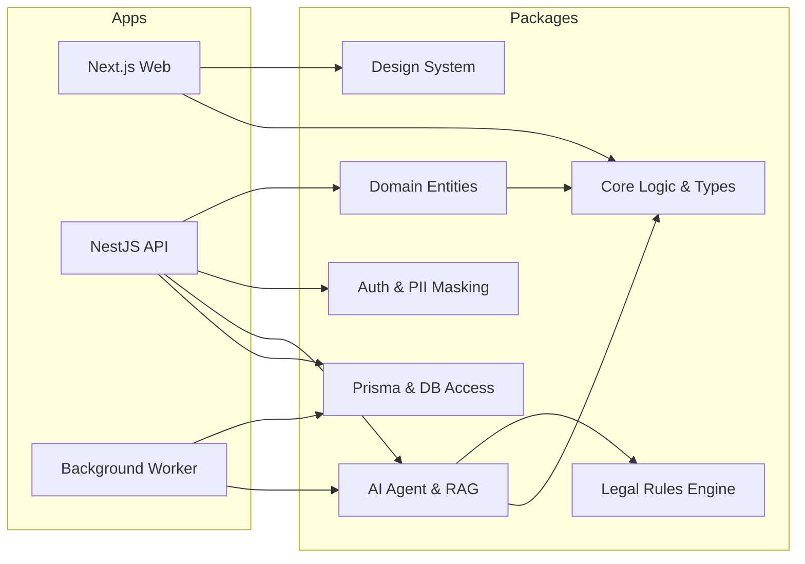

# Panduan Pengembangan (Development Guide) - Lawyers Hub

Selamat datang di Lawyers Hub. Dokumen ini adalah panduan untuk pengembang dalam membangun sistem Legal SaaS yang skalabel.

## Arsitektur Sistem

## Alur Kerja Pengembangan

1. **Prasyarat**: Node.js >= 18, npm >= 9.
2. **Instalasi**: `npm install`.
3. **Menjalankan Dev Server**: `npm run dev` (Menjalankan semua aplikasi via Turbo).
4. **Menambah Package Baru**: Gunakan struktur di folder `packages/` dan daftarkan di root `package.json` workspaces.

## Prinsip Implementasi (@SOLOBuilder)

- **Clean Architecture**: Selalu letakkan logika bisnis murni di `packages/domain`.
- **Dry (Don't Repeat Yourself)**: Gunakan `packages/core` untuk utilitas dan tipe data bersama.
- **Tenant Isolation**: Gunakan `tenant_id` pada setiap query database.

---
*Disusun oleh: @SOLOBuilder*
