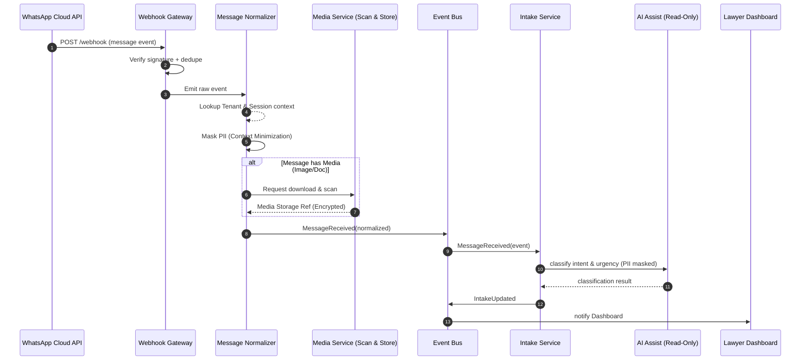
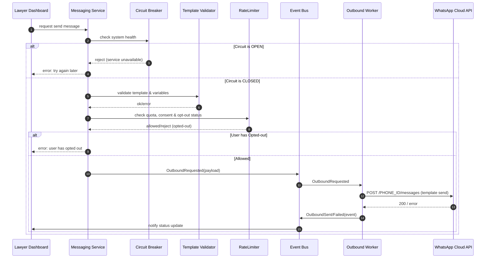
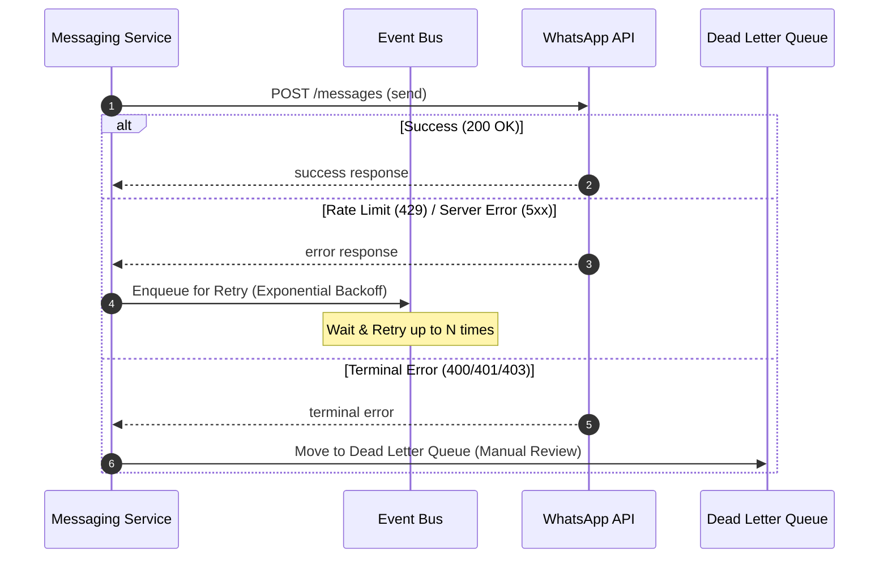
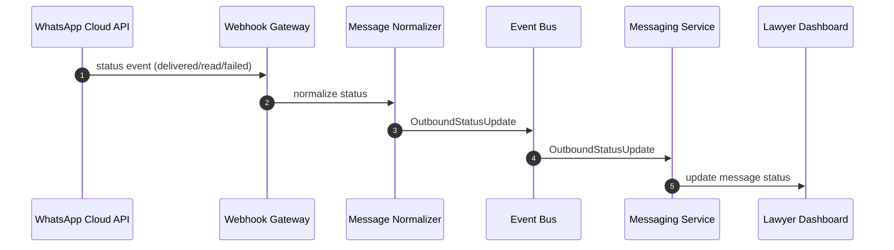

Berikut **isi mendalam untuk file: `02_Diagram_Sequence_Inbound_Outbound.md`** — disusun secara **terstruktur & siap dokumentasi teknis**, termasuk *sequence diagrams* dan konteks WhatsApp Cloud API yang relevan.

---

````markdown
# 📘 02_Diagram_Sequence_Inbound_Outbound.md
## WhatsApp Integration — Inbound & Outbound Sequence Diagrams
*Version: 1.0 | Last Updated: 2026-01-05*

---

## 🎯 Tujuan Dokumen

File ini memberikan **diagram urutan (sequence)** untuk alur kerja WhatsApp di Lawyers-Hub — mencakup:

✅ Inbound flow (pesan masuk)  
✅ Outbound flow (pesan keluar / template send)  
✅ Penjelasan tiap langkah  
✅ Boundary rules yang harus dipatuhi

Diagram ini berguna untuk:
- Engineering design
- Code implementasi
- Test automation / contract testing

---

## 📌 Catatan Teknis Dasar

Sebelum melihat sequence, penting memahami konteks WhatsApp Cloud API:

✔️ WhatsApp menggunakan **webhook callback** untuk event pesan masuk  
✔️ Outbound ke WhatsApp *harus menggunakan template* di luar 24-jam window  
✔️ Semua status (sent, delivered, read) dikirim via webhook :contentReference[oaicite:0]{index=0}

---

## 📍 1️⃣ Inbound Message Flow (WhatsApp → Lawyers-Hub)

**Tujuan:** menangkap pesan dari pengguna, menormalisasi, lalu memicu proses internal (intake/triage/AI classify).



### 💡 Penjelasan Inbound
1. **Webhook Gateway menerima event:** Meta akan POST payload ke webhook. Gateway memverifikasi signature HMAC.
2. **Normalizer:** Transformasi payload WhatsApp ke format internal. Mencari `tenantId` berdasarkan nomor tujuan (WABA mapping).
3. **Media Handling:** Jika pesan berisi file, Media Service mengunduh, melakukan virus scan, dan menyimpan ke storage terenkripsi.
4. **Event Bus:** Mengurangi coupling antara ingestion dan business logic.
5. **Intake Service:** Memproses pesan dalam konteks sesi konsultasi.
6. **AI Assist:** Melakukan klasifikasi awal (intent/urgensi) dengan data yang sudah di-mask (tanpa PII).

---

## 📍 2️⃣ Outbound Message Flow (Lawyer → WhatsApp)

**Tujuan:** mengirimkan pesan terstruktur (template) melalui WhatsApp dari platform internal.



### 💡 Penjelasan Outbound
1. **Circuit Breaker:** Memastikan sistem tidak membebani WhatsApp API jika terdeteksi banyak kegagalan beruntun.
2. **Template Validator:** Memastikan pesan sesuai template yang disetujui Meta untuk menghindari banned.
3. **RateLimiter:** Mengatur kecepatan pengiriman agar tidak melampaui limit akun (Tier 1/2/3).
4. **Outbound Worker:** Mengambil task dari queue dan melakukan call API secara asinkron.

---

## � 3️⃣ Error & Retry Flow (Handling Failures)

**Tujuan:** Menjamin reliabilitas pengiriman pesan saat terjadi kegagalan sistem atau rate limit.



### 💡 Penjelasan Retry
1. **Exponential Backoff:** Untuk error yang bersifat sementara (429/5xx), sistem akan mencoba kembali dengan jeda waktu yang meningkat.
2. **Dead Letter Queue (DLQ):** Error yang tidak bisa diperbaiki secara otomatis (misal: template tidak valid) akan dipindahkan ke DLQ untuk ditinjau oleh tim engineering.

---

## �� 3️⃣ Delivery & Status Update Loop

Setelah outbound dikirim, Meta akan memanggil webhook lagi dengan status update untuk:

* delivered
* read
* failed



> Catatan: status delivery sangat penting untuk SLA & billing audit.

---

## 📌 Boundary Rules — Inbound & Outbound

### 🔐 Inbound Validation

* signature harus valid
* message id bisa digunakan untuk deduplication
* webhook harus respons cepat <200ms (untuk reliabilitas) ([DevOps School][2])

### 📬 Outbound Template Rules

* Hanya **template yang disetujui Meta** yang dapat digunakan ([Smooch Documentation][3])
* harus ada **consent eksplisit** sebelum mengirim
* jika >24 jam dari last inbound, pakai template; jika <24 jam, freeform bisa diterima

---

## 🧠 Sequence Diagram Layering Tips

* **LAYER 1:** Network entry (Webhook)
* **LAYER 2:** Core ingestion (Normalizer)
* **LAYER 3:** Business logic (Intake / Messaging / Billing)
* **LAYER 4:** UI Updates (Dashboard / Notification)
* **LAYER 5:** Persistence & Audit log

Diagram ini bisa dibuat ke format **PlantUML, Mermaid, atau bahkan sequence visualization untuk dev team**.

---

## 📊 Contoh JSON Event (Inbound)

*Berisi minimal fields yang sering dipakai dalam integration:*

```json
{
  "object": "whatsapp_business_account",
  "entry": [
    {
      "id": "<WABA_ID>",
      "changes": [
        {
          "value": {
            "messaging_product": "whatsapp",
            "contacts": [ { "wa_id": "<E164>" } ],
            "messages": [ { "id": "...", "type": "text", "text": { "body": "..." } } ]
          },
          "field": "messages"
        }
      ]
    }
  ]
}
```

> Ini contoh dasar dari webhook WhatsApp Cloud API. ([meta-preview.mintlify.io][4])

---

## 🧩 Tips Implementasi

✔️ Pastikan webhook subscription untuk events `messages` dan delivery status
✔️ Test webhook with public HTTPS (dev → prod)
✔️ Implement idempotency with message ID + timestamp
✔️ Use async job queue for scaling

---

## ✨ Kesimpulan

Sequence diagram ini memberi panduan tut-tumis yang:

* aman dari segi data & compliance
* scalable & observable
* jelas boundary antara inbound/outbound
* terintegrasi dengan event bus
  Dokumen ini harus jadi referensi utama tim engineering saat membuat pipeline WhatsApp di Lawyers-Hub.

---

## 🔗 Referensi

* WhatsApp template rules & Cloud API basics (Meta) ([Smooch Documentation][3])
* WhatsApp Cloud API setup & webhook behavior ([meta-preview.mintlify.io][4])

```

---

Jika format ini sudah pas, saya bisa langsung lanjut ke **file berikutnya**:  
➡️ `03_WhatsApp_Gateway_Blueprint.md` — lengkap dengan *API surface, signature verification, dedup logic, contract schema*, dan test plan.

Tinggal bilang **lanjut**.
::contentReference[oaicite:7]{index=7}
```

[1]: https://respond.io/help/whatsapp/whatsapp-cloud-api?utm_source=chatgpt.com "WhatsApp Cloud API"
[2]: https://www.devopsschool.com/blog/whatsapp-cloud-api-direct-integration-with-meta/?utm_source=chatgpt.com "WhatsApp Cloud API: Direct Integration with Meta - DevOpsSchool.com"
[3]: https://docs.smooch.io/guide/whatsapp/?utm_source=chatgpt.com "Sunshine Conversations Docs | WhatsApp"
[4]: https://meta-preview.mintlify.io/docs/whatsapp/cloud-api/overview?utm_source=chatgpt.com "Overview - Developers Meta Docs"
