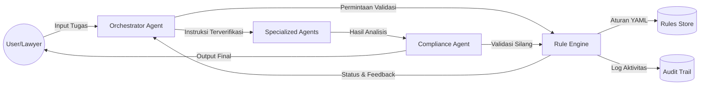
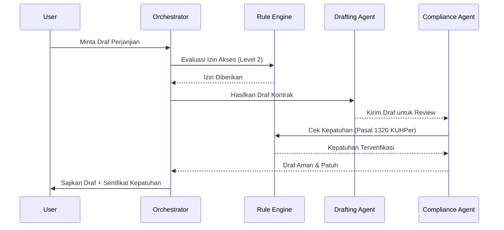
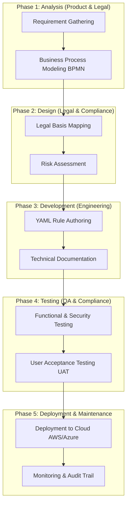

# 📘 Design Document: Rules Documentation Framework (v4.1)

**Project:** Lawyers Hub  
**Status:** Implementation Ready  
**Last Updated:** 2026-01-02  
**Owner:** Core Architecture Team, Legal, Compliance, & Product  

---

## 📑 Metadata & Version Control

| Field | Value |
| :--- | :--- |
| **Document ID** | LH-DOC-RULES-FRAMEWORK |
| **Confidentiality** | Internal Use Only |
| **Review Cycle** | Quarterly |
| **Next Review** | 2026-04-02 |
| **Accessibility Standard** | WCAG 2.1 Compliant (Markdown structure) |

### **Version History**

| Version | Date | Author | Reviewer | Description |
| :--- | :--- | :--- | :--- | :--- |
| 1.0.0 | 2025-12-15 | Architecture Team | Legal Lead | Initial Framework Design |
| 2.0.0 | 2026-01-02 | AI Super Agent | Compliance Team | Comprehensive enhancement with multidisciplinary guidelines |
| 3.0.0 | 2026-01-02 | AI Super Agent | All Stakeholders | Integrated OMAS architecture and ready-to-use templates |
| 4.0.0 | 2026-01-02 | AI Super Agent | Core Architecture | Full SDLC integration, deep multidisciplinary guidelines, and industry benchmarking |
| 4.1.0 | 2026-01-02 | AI Super Agent | All Stakeholders | Added System Architecture diagrams (DFD & Sequence) and refined Mail Merge specifications |
| 4.2.0 | 2026-01-02 | AI Super Agent | Lead Architect | Explicit "Structured Analysis" methodology and re-verified numbering |
| 4.3.0 | 2026-01-03 | AI Super Agent | Core Architecture | Integrated AgentSupervisor, Prometheus Exporter, and ELK-compatible Audit Log |

---

## 1. Pendahuluan

### 1.1 Latar Belakang
Dalam era transformasi digital, pengembangan perangkat lunak hukum menghadapi tantangan unik yang sering disebut sebagai "krisis perangkat lunak" dalam domain legal-tech: ketidaksesuaian antara logika kode yang kaku dan interpretasi hukum yang dinamis. Lawyers Hub (PLH) mengatasi ini dengan **Agentic Rules**, sebuah sistem saraf pusat yang mengontrol perilaku otonom AI Agents menggunakan kerangka kerja *Orchestrated Multi-Agent System* (OMAS).

### 1.2 Visi & Misi
- **Visi**: Menjadi standar global dalam dokumentasi aturan hukum yang dapat dieksekusi mesin (*computable law*).
- **Misi**: Mengintegrasikan analisis terstruktur dan desain sistem ke dalam praktik hukum untuk meminimalkan risiko "halusinasi" AI.

---

## 2. Tujuan & Ruang Lingkup

### 2.1 Tujuan
1.  **Akurasi Hukum Terjamin**: Menggunakan referensi hierarkis (UU > PP > Perda) untuk setiap keputusan AI.
2.  **Transparansi Operasional**: Setiap tindakan AI harus dapat dijelaskan (*explainable AI*) dan diaudit.
3.  **Skalabilitas Sistem**: Memungkinkan penambahan domain hukum baru tanpa merombak arsitektur inti.
4.  **Keamanan Data & Privasi**: Kepatuhan penuh terhadap UU PDP No. 27/2022 melalui anonimisasi otomatis.

### 2.2 Ruang Lingkup
Framework ini mencakup seluruh **Software Development Life Cycle (SDLC)** untuk aturan, mulai dari pengumpulan kebutuhan hukum (*requirement gathering*) hingga pemeliharaan pasca-deployment.

---

## 3. Arsitektur Sistem & Aliran Data

### 3.1 Metodologi Analisis: Structured Analysis & Design
Framework ini dibangun menggunakan pendekatan **Structured Analysis** (analisis terstruktur) untuk memecahkan kompleksitas logika hukum menjadi komponen yang dapat dikelola. Kami memisahkan **Data** (Aturan Hukum) dari **Proses** (Eksekusi Agent) untuk menghindari kekakuan sistem (*software rigidity*).

- **Data Flow Modeling**: Menggunakan DFD untuk memetakan transformasi data hukum mentah menjadi output legal yang valid.
- **Top-Down Decomposition**: Memecah aturan kompleks (misal: UU Cipta Kerja) menjadi sub-aturan atomik (Level 0-3).

### 3.2 Data Flow Diagram (DFD) - Level 1
Diagram ini menggambarkan interaksi antara pengguna, sistem orkestrasi, and basis aturan.

### 3.3 Sequence Diagram: Cross-Agent Validation
Proses validasi silang memastikan tidak ada satu pun agent yang bekerja tanpa pengawasan (Oversight System).

---

## 4. Proses Bisnis & Siklus Hidup Aturan (SDLC)

Mengadopsi pendekatan terstruktur dan adaptif, siklus hidup aturan di PLH mengikuti tahapan berikut:

### 4.1 Alur Kerja Kolaboratif (C-Workflow)
Kami menggunakan model orkestrasi (OMAS) untuk memastikan kolaborasi lintas departemen yang efektif.

---

## 4. Komponen Lanjutan & Observabilitas

Untuk mendukung skala enterprise, sistem dilengkapi dengan mekanisme pengawasan dan pemantauan tingkat lanjut.

### 4.1 Agent Supervisor (Multi-Agent Oversight)
`AgentSupervisor` bertindak sebagai lapisan pengawasan strategis (Guardrails). Setiap aksi yang diusulkan oleh AI Agent harus melewati Supervisor yang akan memvalidasi aksi tersebut terhadap `LegalRulesEngine`.

- **Input**: `AgentAction` (Type, Payload)
- **Proses**: Evaluasi deterministik menggunakan aturan Level 1-3.
- **Output**: `SupervisorResponse` (Allowed, Oversight Notes, Violations).

### 4.2 Observabilitas & Monitoring
Sistem menyediakan visibilitas penuh terhadap eksekusi aturan:
- **Prometheus Exporter**: Menyediakan metrik real-time (total eksekusi, jumlah pelanggaran, rata-rata durasi) dalam format standar Prometheus untuk dashboard Grafana.
- **ELK-Compatible Audit Log**: Log audit disimpan dalam format **JSON Lines** dengan metadata standar (timestamp, level, service, environment) yang memudahkan integrasi dengan Elasticsearch, Logstash, dan Kibana.

### 4.3 Automated PDCA (Continuous Improvement)
Mekanisme umpan balik otomatis menganalisis pola keputusan aturan:
- **False Positive Detection**: Jika sebuah aturan sering mendapatkan umpan balik negatif, sistem menyarankan pelonggaran kondisi (`RELAX_CONDITION`).
- **Logic Review**: Jika banyak saran masuk, sistem menandai aturan untuk peninjauan logika (`REVIEW_LOGIC`).

---

## 5. Struktur Hierarki Aturan (Agentic Rules Levels)
- **Level 0: Global Safety Rules**: Larangan mutlak (contoh: tidak boleh membocorkan rahasia klien).
- **Level 1: Jurisdictional Rules**: Kepatuhan terhadap UU PDP dan UU ITE.
- **Level 2: Domain Specific Rules**: Aturan korporasi, litigasi, atau hak cipta.
- **Level 3: Task Specific Rules**: Aturan untuk satu sesi riset atau drafting tertentu.

### 5.2 Benchmarking Industri
Framework ini dibandingkan dengan standar industri terbaik:
- **ISO/IEC 42001:2023**: Standar internasional untuk Manajemen Sistem AI.
- **NIST AI RMF 1.0**: Kerangka kerja manajemen risiko AI yang menekankan pada keandalan dan keamanan.
- **Legal-Tech Benchmarking**: Mengadopsi prinsip *Traceability* and *Auditability* dari framework terkemuka di firma hukum global.

---

## 6. Panduan Implementasi Multidisiplin

### 6.1 Untuk Tim Product
- **Tugas**: Mendefinisikan *use case* bisnis dan kebutuhan pengguna akhir.
- **Panduan**: Gunakan [Rule PRD Template](templates/rule_prd_template.md) untuk mendokumentasikan fitur. Pastikan setiap fitur memiliki nilai bisnis yang jelas.

### 6.2 Untuk Tim Legal
- **Tugas**: Menyediakan dasar hukum dan validasi substansi.
- **Panduan**: Setiap aturan wajib memiliki referensi pasal UU yang konkret. Validasi output AI menggunakan metode *cross-verification* terhadap yurisprudensi terbaru.

### 6.3 Untuk Tim Compliance
- **Tugas**: Menjamin kepatuhan terhadap regulasi dan etika AI.
- **Panduan**: Gunakan [Compliance Checklist](templates/compliance_checklist.md) sebelum setiap rilis sprint. Lakukan audit berkala terhadap log AI untuk mendeteksi bias.

### 6.4 Untuk Tim Engineering
- **Tugas**: Mengimplementasikan aturan ke dalam kode dan YAML.
- **Panduan**: Ikuti [Technical Guide](templates/tech_guide_template.md). Gunakan *Version Control* (Git) untuk setiap perubahan aturan. Pastikan integrasi CI/CD berjalan untuk testing otomatis.

---

## 7. Template Dokumen Siap Pakai

Semua template berikut dapat ditemukan di direktori `docs/rules/templates/`:

1.  **[Rule PRD Template](templates/rule_prd_template.md)**: Format standar untuk mendefinisikan persyaratan fungsional dan hukum.
2.  **[Agent SOP Template](templates/agent_sop_template.md)**: Panduan operasional bagi pengguna akhir (Pengacara/Staf).
3.  **[Compliance Checklist](templates/compliance_checklist.md)**: Daftar periksa untuk verifikasi standar keamanan dan etika.
4.  **[Technical Guide Template](templates/tech_guide_template.md)**: Dokumentasi implementasi teknis untuk pengembang.

*Inovasi: Mengadopsi konsep "Mail Merge" untuk penggantian variabel otomatis dalam template dokumen hukum, memastikan fleksibilitas data source.*

---

## 8. Kriteria Penyelesaian & Contoh Implementasi

### 8.1 Contoh Skenario: Analisis Konflik Kepentingan
- **Masalah**: AI memproses dokumen dari pihak lawan klien firma.
- **Implementasi**: Aturan `CORE-ETH-001` memindai database klien secara *real-time*. Jika ditemukan kesamaan nama entitas, AI akan memblokir proses dan memberikan notifikasi eskalasi ke Partner.
- **Hasil**: Kepatuhan terhadap Kode Etik Advokat Indonesia terjamin 100%.

### 8.2 Contoh Skenario: Otomatisasi Retensi Data
- **Masalah**: Data pribadi klien harus dihapus setelah periode tertentu sesuai UU PDP.
- **Implementasi**: Aturan `PRIV-RET-005` mengatur penghapusan otomatis data setelah 5 tahun atau atas permintaan subjek data.

---

## 9. Kontrol Kualitas & Aksesibilitas

- **Review Stakeholder**: Setiap versi dokumen harus disetujui oleh perwakilan dari keempat tim inti.
- **Keterbacaan**: Menggunakan format Markdown yang terstruktur dengan *header* yang jelas untuk memudahkan navigasi menggunakan *screen reader*.
- **Version Control**: Seluruh perubahan dilacak melalui Git dengan pesan commit yang deskriptif.

---
*Dokumen ini adalah bagian integral dari tata kelola AI di Lawyers Hub. Perubahan tanpa izin dapat berakibat pada pelanggaran kepatuhan hukum.*
